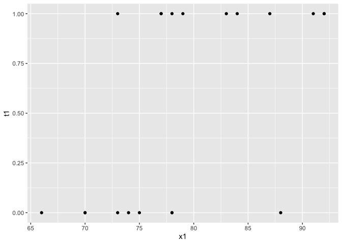
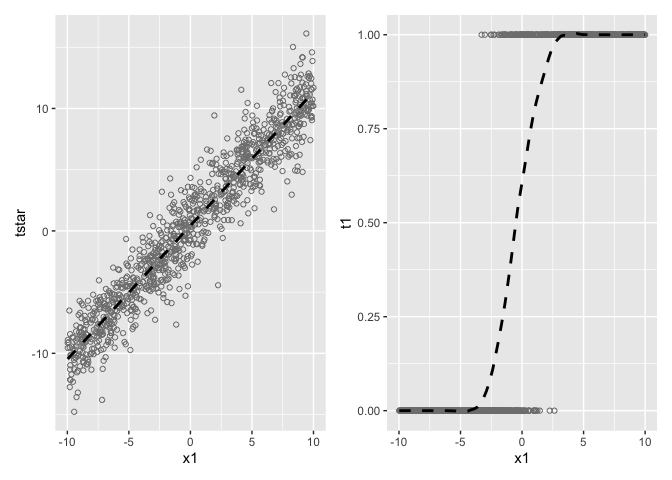
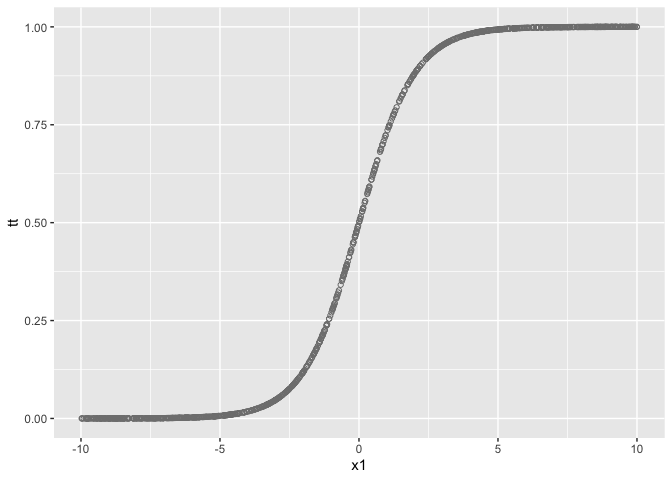
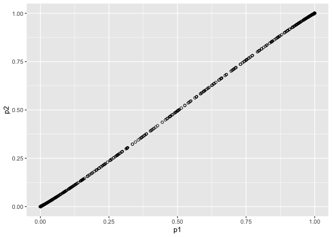

# chapter10_傾向スコア


## 前準備

``` r
library(tidyverse)
```

    ── Attaching core tidyverse packages ──────────────────────── tidyverse 2.0.0 ──
    ✔ dplyr     1.1.4     ✔ readr     2.1.5
    ✔ forcats   1.0.0     ✔ stringr   1.5.1
    ✔ ggplot2   3.5.1     ✔ tibble    3.2.1
    ✔ lubridate 1.9.3     ✔ tidyr     1.3.1
    ✔ purrr     1.0.2     
    ── Conflicts ────────────────────────────────────────── tidyverse_conflicts() ──
    ✖ dplyr::filter() masks stats::filter()
    ✖ dplyr::lag()    masks stats::lag()
    ℹ Use the conflicted package (<http://conflicted.r-lib.org/>) to force all conflicts to become errors

``` r
library(patchwork)

DATA10A <- "https://raw.githubusercontent.com/mtakahashi123/causality/main/data10a.csv"
DATA10B <- "https://raw.githubusercontent.com/mtakahashi123/causality/main/data10b.csv"
DATA10C <- "https://raw.githubusercontent.com/mtakahashi123/causality/main/data10c.csv"
DATA03 <- "https://raw.githubusercontent.com/mtakahashi123/causality/main/data03.csv"

data10a <- read_csv(DATA10A)
```

    Rows: 20 Columns: 5
    ── Column specification ────────────────────────────────────────────────────────
    Delimiter: ","
    dbl (5): y0t, y1t, t1, y, x1

    ℹ Use `spec()` to retrieve the full column specification for this data.
    ℹ Specify the column types or set `show_col_types = FALSE` to quiet this message.

``` r
data10b <- read_csv(DATA10B)
```

    Rows: 20 Columns: 8
    ── Column specification ────────────────────────────────────────────────────────
    Delimiter: ","
    dbl (8): y0t, y1t, t1, y, x1, x2, x3, ps1

    ℹ Use `spec()` to retrieve the full column specification for this data.
    ℹ Specify the column types or set `show_col_types = FALSE` to quiet this message.

``` r
data10c <- read_csv(DATA10C)
```

    Rows: 8 Columns: 8
    ── Column specification ────────────────────────────────────────────────────────
    Delimiter: ","
    dbl (8): y0t, y1t, t1, y, x1, x2, x3, ps1

    ℹ Use `spec()` to retrieve the full column specification for this data.
    ℹ Specify the column types or set `show_col_types = FALSE` to quiet this message.

``` r
data03 <- read_csv(DATA03)
```

    Rows: 20 Columns: 5
    ── Column specification ────────────────────────────────────────────────────────
    Delimiter: ","
    dbl (5): x1, y3, t1, y0t, y1t

    ℹ Use `spec()` to retrieve the full column specification for this data.
    ℹ Specify the column types or set `show_col_types = FALSE` to quiet this message.

### バランシングスコア

``` r
print(data10a |> pull(y1t) |> mean() - data10a |> pull(y0t) |> mean()) # ATE
```

    [1] 9.95

``` r
data10a |> filter(t1 == 1) |> pull(y1t) |> mean() - data10a |> filter(t1 == 1) |> pull(y0t) |> mean() # ATT
```

    [1] 9.090909

``` r
data10a |> filter(t1 == 1) |> pull(y) |> mean() - data10a |> filter(t1 == 0) |> pull(y) |> mean()
```

    [1] 17.39394

``` r
data10a |>
  ggplot(aes(x = x1, y = t1)) +
  geom_point()
```



``` r
print(data10a |> filter(t1 == 0) |> pull(x1) |> summary())
```

       Min. 1st Qu.  Median    Mean 3rd Qu.    Max. 
      66.00   70.00   74.00   74.67   78.00   88.00 

``` r
print(data10a |> filter(t1 == 1) |> pull(x1) |> summary())
```

       Min. 1st Qu.  Median    Mean 3rd Qu.    Max. 
       73.0    77.5    83.0    83.0    89.0    92.0 

### 傾向スコア

``` r
print(data10b |> filter(t1 == 0) |> pull(x1) |> summary())
```

       Min. 1st Qu.  Median    Mean 3rd Qu.    Max. 
      66.00   70.00   74.00   74.67   78.00   88.00 

``` r
print(data10b |> filter(t1 == 1) |> pull(x1) |> summary())
```

       Min. 1st Qu.  Median    Mean 3rd Qu.    Max. 
       73.0    77.5    83.0    83.0    89.0    92.0 

``` r
print(data10b |> filter(t1 == 0) |> pull(x2) |> summary())
```

       Min. 1st Qu.  Median    Mean 3rd Qu.    Max. 
      60.00   75.00   76.00   74.78   78.00   79.00 

``` r
print(data10b |> filter(t1 == 1) |> pull(x2) |> summary())
```

       Min. 1st Qu.  Median    Mean 3rd Qu.    Max. 
      66.00   75.50   81.00   80.82   83.50  102.00 

``` r
print(data10b |> filter(t1 == 0) |> pull(x3) |> summary())
```

       Min. 1st Qu.  Median    Mean 3rd Qu.    Max. 
      55.00   73.00   74.00   72.56   78.00   82.00 

``` r
print(data10b |> filter(t1 == 1) |> pull(x3) |> summary())
```

       Min. 1st Qu.  Median    Mean 3rd Qu.    Max. 
      60.00   78.00   83.00   82.18   87.00  101.00 

共変量 $X$
が与えられたとき、処置に割り付けられる確率を傾向スコアという。

$$
e(\mathbf{X}) = \mathrm{Pr}(T_i = 1 | \mathbf{X})
$$

``` r
data10c |> filter(t1 == 1) |> pull(y) |> mean() - data10c |> filter(t1 == 0) |> pull(y) |> mean()
```

    [1] 8.5

``` r
print(data10c |> filter(t1 == 0) |> pull(x1) |> summary())
```

       Min. 1st Qu.  Median    Mean 3rd Qu.    Max. 
       74.0    77.0    78.0    79.5    80.5    88.0 

``` r
print(data10c |> filter(t1 == 1) |> pull(x1) |> summary())
```

       Min. 1st Qu.  Median    Mean 3rd Qu.    Max. 
      73.00   76.00   78.00   78.25   80.25   84.00 

``` r
print(data10c |> filter(t1 == 0) |> pull(x2) |> summary())
```

       Min. 1st Qu.  Median    Mean 3rd Qu.    Max. 
      72.00   75.00   77.00   76.25   78.25   79.00 

``` r
print(data10c |> filter(t1 == 1) |> pull(x2) |> summary())
```

       Min. 1st Qu.  Median    Mean 3rd Qu.    Max. 
      66.00   72.00   75.00   74.25   77.25   81.00 

``` r
print(data10c |> filter(t1 == 0) |> pull(x3) |> summary())
```

       Min. 1st Qu.  Median    Mean 3rd Qu.    Max. 
      64.00   71.50   76.50   74.75   79.75   82.00 

``` r
print(data10c |> filter(t1 == 1) |> pull(x3) |> summary())
```

       Min. 1st Qu.  Median    Mean 3rd Qu.    Max. 
      60.00   72.75   79.50   77.25   84.00   90.00 

## 傾向スコア定理

- 定理１（バランシング）：処置の割り付け $T$ と観測された共変量 $X$
  は、傾向スコア $e(X)$
  が与えられた時、条件つき独立である。すなわち、傾向スコア $e(X)$
  が同じ値であれば、処置群と統制群における多変量の共変量 $X$
  の分布は同じであることを意味している。

  $$
  \mathbf{X} \perp T|e(\mathbf{X})
  $$

- 定理２（条件付き独立性）：傾向スコア $e(X)$
  が与えられれば、潜在的結果変数 $\{Y(1), Y(0)\}$ と割り付け変数 $T$
  は条件つき独立である。すなわち、傾向スコアが同じ値となる個体であれば、処置への割り付けは無作為と見做せるということである。

  $$
  \{Y(1), Y(0)\} \perp T|e(\mathbf{X})
  $$

傾向スコアのモデリングでは、処置の割り付けに影響を与えるものは観測される共変量
$\mathbf{X}$ のみと仮定しているため、k観測されない共変量 $\mathbf{U}$
のバランシングまでは保証しない。一方実験研究ならば、観測されない
$\mathbf{U}$ のバランシングまで保証される。

## 傾向スコアのモデル化

### R による確認

``` r
set.seed(1)
n1 <- 1000
b0 <- 0.5
b1 <- 1.1
x1 <- runif(n = n1, min = -10, max = 10)
e1 <- rlogis(n = n1, location = 0, scale = 1)
tstar <- b0 + b1 * x1 + e1

tstar <- tibble(tstar) |>
  mutate(
    x1 = x1,
    t1 = if_else(tstar > 0, 1, 0)
  )

p1 <- ggplot(tstar, aes(x = x1, y = tstar)) +
  geom_point(color = "gray50", shape = 1) +
  geom_smooth(method = "lm", e = FALSE, color = "black", linetype = "dashed")
```

    Warning in geom_smooth(method = "lm", e = FALSE, color = "black", linetype =
    "dashed"): Ignoring unknown parameters: `e`

``` r
p2 <- ggplot(tstar, aes(x = x1, y = t1)) +
  geom_point(color = "gray50", shape = 1) +
  geom_smooth(method = "loess", span = 0.25, se = FALSE, color = "black", linetype = "dashed")

p1 + p2
```

    `geom_smooth()` using formula = 'y ~ x'
    `geom_smooth()` using formula = 'y ~ x'



### ロジスティック回帰モデル

``` r
tibble(x1) |>
  mutate(
    tt = plogis(x1)
  ) |>
  ggplot(aes(x = x1, y = tt)) + geom_point(shape =1, color = "gray50")
```



$$
\mathrm{Pr}(T_i = 1|X_i) = \frac{exp(\beta_0 + \beta_1 X_i)}{1 + exp(\beta_0 + \beta_1 X_i)}
$$

### 傾向スコアの算出

``` r
numerator <- exp(b0 + b1 * x1)
denominator <- 1 + exp(b0 + b1 * x1)
p1 <- numerator / denominator
```

``` r
model2 <- tstar |>
  glm(t1 ~ x1, family = binomial(link = "logit"), data = _)

p2 <- model2$fitted.values

print(summary(model2))
```


    Call:
    glm(formula = t1 ~ x1, family = binomial(link = "logit"), data = tstar)

    Coefficients:
                Estimate Std. Error z value Pr(>|z|)    
    (Intercept)  0.50846    0.15781   3.222  0.00127 ** 
    x1           1.16203    0.09922  11.712  < 2e-16 ***
    ---
    Signif. codes:  0 '***' 0.001 '**' 0.01 '*' 0.05 '.' 0.1 ' ' 1

    (Dispersion parameter for binomial family taken to be 1)

        Null deviance: 1385.81  on 999  degrees of freedom
    Residual deviance:  298.47  on 998  degrees of freedom
    AIC: 302.47

    Number of Fisher Scoring iterations: 8

``` r
cor(p1, p2)
```

    [1] 0.9999416

``` r
tibble(p1, p2) |> ggplot(aes(x = p1, y = p2)) + geom_point(shape = 1)
```



## 傾向スコアのモデル化の例

``` r
data03 |> summary()
```

           x1              y3              t1           y0t             y1t       
     Min.   :70.00   Min.   :63.00   Min.   :0.0   Min.   :62.00   Min.   :71.00  
     1st Qu.:73.75   1st Qu.:73.75   1st Qu.:0.0   1st Qu.:66.50   1st Qu.:75.50  
     Median :80.00   Median :77.00   Median :0.5   Median :71.00   Median :81.50  
     Mean   :80.00   Mean   :77.25   Mean   :0.5   Mean   :72.20   Mean   :82.00  
     3rd Qu.:86.25   3rd Qu.:82.00   3rd Qu.:1.0   3rd Qu.:78.75   3rd Qu.:88.75  
     Max.   :90.00   Max.   :91.00   Max.   :1.0   Max.   :82.00   Max.   :92.00  

傾向スコアのモデル化

``` r
psmodel <- data03 |> glm(data = _, formula = t1 ~ x1, family = binomial(link = "logit"))
ps3 <- round(psmodel$fitted.values, digits = 4)
ps4 <- c(
  rep(x = 0.8, times = 5),
  rep(x = 0.6, times = 5),
  rep(x = 0.4, times = 5),
  rep(x = 0.2, 5)
)

df2 <- data03 |> select(x1, y3, t1) |> mutate(ps3, ps4)
df2
```

    # A tibble: 20 × 5
          x1    y3    t1   ps3   ps4
       <dbl> <dbl> <dbl> <dbl> <dbl>
     1    70    74     1 0.775   0.8
     2    70    63     0 0.775   0.8
     3    70    73     1 0.775   0.8
     4    70    71     1 0.775   0.8
     5    70    74     1 0.775   0.8
     6    75    67     0 0.650   0.6
     7    75    77     1 0.650   0.6
     8    75    68     0 0.650   0.6
     9    75    77     1 0.650   0.6
    10    75    78     1 0.650   0.6
    11    85    88     1 0.350   0.4
    12    85    77     0 0.350   0.4
    13    85    76     0 0.350   0.4
    14    85    86     1 0.350   0.4
    15    85    78     0 0.350   0.4
    16    90    81     0 0.225   0.2
    17    90    91     1 0.225   0.2
    18    90    82     0 0.225   0.2
    19    90    82     0 0.225   0.2
    20    90    82     0 0.225   0.2

## R パッケージ `MatchIt` による傾向スコアのモデル化

``` r
library(MatchIt)

m.out <- MatchIt::matchit(formula = t1 ~ x1, data = data03)
ps5 <- m.out$model$fitted.values

print(summary(ps3))
```

       Min. 1st Qu.  Median    Mean 3rd Qu.    Max. 
     0.2249  0.3188  0.5000  0.5000  0.6812  0.7751 

``` r
print(summary(ps5))
```

       Min. 1st Qu.  Median    Mean 3rd Qu.    Max. 
     0.2249  0.3188  0.5000  0.5000  0.6812  0.7751 

``` r
print(cor(ps3, ps5))
```

    [1] 1
