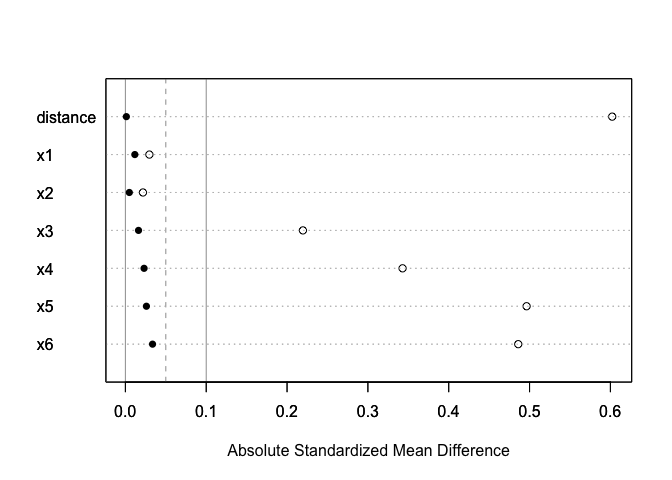
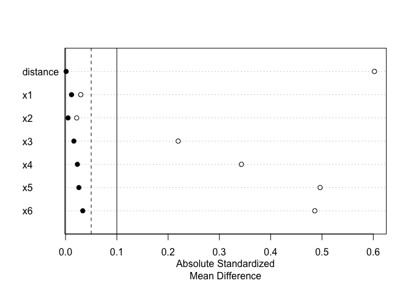
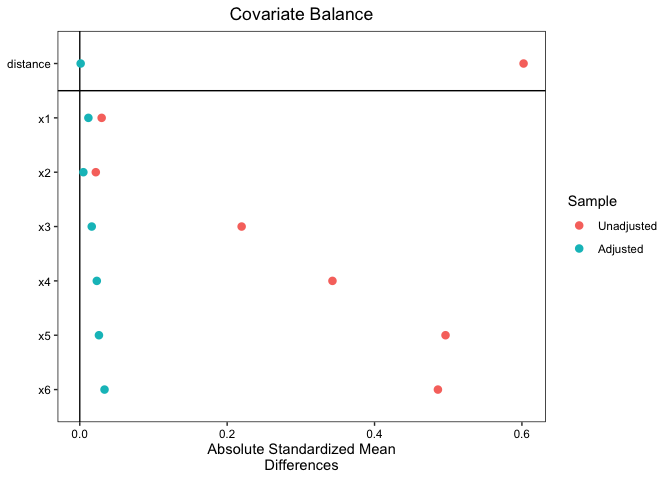

# chapter11_傾向スコアマッチング：ATT の推定


## 前準備

``` r
library(tidyverse)
```

    ── Attaching core tidyverse packages ──────────────────────── tidyverse 2.0.0 ──
    ✔ dplyr     1.1.4     ✔ readr     2.1.5
    ✔ forcats   1.0.0     ✔ stringr   1.5.1
    ✔ ggplot2   3.5.1     ✔ tibble    3.2.1
    ✔ lubridate 1.9.3     ✔ tidyr     1.3.1
    ✔ purrr     1.0.2     
    ── Conflicts ────────────────────────────────────────── tidyverse_conflicts() ──
    ✖ dplyr::filter() masks stats::filter()
    ✖ dplyr::lag()    masks stats::lag()
    ℹ Use the conflicted package (<http://conflicted.r-lib.org/>) to force all conflicts to become errors

``` r
library(MatchIt)

DATA11 <- "https://raw.githubusercontent.com/mtakahashi123/causality/main/data11.csv"
data11 = read_csv(DATA11)
```

    Rows: 1000 Columns: 10
    ── Column specification ────────────────────────────────────────────────────────
    Delimiter: ","
    dbl (10): y0t, y1t, y3, t1, x1, x2, x3, x4, x5, x6

    ℹ Use `spec()` to retrieve the full column specification for this data.
    ℹ Specify the column types or set `show_col_types = FALSE` to quiet this message.

## 使用するデータ

推定対象の真値

``` r
# ATT
cat("ATT:", data11 |> filter(t1 == 1) |> pull(y1t) |> mean() - data11 |> filter(t1 == 1) |> pull(y0t) |> mean(), "\n")
```

    ATT: 2.888651 

``` r
# ATE
cat("ATE:", data11 |> summarize(mean(y1t) - mean(y0t)) |> pull(), "\n")
```

    ATE: 3.755947 

## ナイーブな比較と共分散分析

ナイーブな比較

``` r
data11 |> lm(data = _, formula = y3 ~ t1) |> summary()
```


    Call:
    lm(formula = y3 ~ t1, data = data11)

    Residuals:
        Min      1Q  Median      3Q     Max 
    -62.190 -13.494  -1.613  15.272  69.376 

    Coefficients:
                Estimate Std. Error t value Pr(>|t|)    
    (Intercept)  26.2678     0.9065   28.98   <2e-16 ***
    t1           15.8099     1.4534   10.88   <2e-16 ***
    ---
    Signif. codes:  0 '***' 0.001 '**' 0.01 '*' 0.05 '.' 0.1 ' ' 1

    Residual standard error: 22.41 on 998 degrees of freedom
    Multiple R-squared:  0.106, Adjusted R-squared:  0.1051 
    F-statistic: 118.3 on 1 and 998 DF,  p-value: < 2.2e-16

共分散分析

``` r
data11 |> lm(data = _, formula = y3 ~ t1 + x1 + x2 + x3 + x4 + x5 + x6) |> summary()
```


    Call:
    lm(formula = y3 ~ t1 + x1 + x2 + x3 + x4 + x5 + x6, data = data11)

    Residuals:
         Min       1Q   Median       3Q      Max 
    -18.9525  -3.0228  -0.1244   3.1150  17.4160 

    Coefficients:
                Estimate Std. Error t value Pr(>|t|)    
    (Intercept)   1.0519     0.3086   3.409 0.000678 ***
    t1            3.4741     0.3266  10.637  < 2e-16 ***
    x1            1.3928     0.1841   7.566 8.77e-14 ***
    x2           -0.2920     0.1942  -1.504 0.132947    
    x3            0.4540     0.1943   2.337 0.019663 *  
    x4            7.4736     0.2046  36.531  < 2e-16 ***
    x5            9.6599     0.1967  49.101  < 2e-16 ***
    x6           11.1501     0.1873  59.545  < 2e-16 ***
    ---
    Signif. codes:  0 '***' 0.001 '**' 0.01 '*' 0.05 '.' 0.1 ' ' 1

    Residual standard error: 4.836 on 992 degrees of freedom
    Multiple R-squared:  0.9586,    Adjusted R-squared:  0.9583 
    F-statistic:  3282 on 7 and 992 DF,  p-value: < 2.2e-16

## R による復元抽出の傾向スコアマッチング：ATT の推定

#### 傾向スコアマッチングによる ATT の推定１

``` r
library(MatchIt)

# 傾向スコアのモデル化
m.out1 <- data11 |>
  MatchIt::matchit(
    data = _,
    formula = t1 ~ x1 + x2 + x3 + x4 + x5 + x6,
    replace = TRUE, # 復元抽出
    distance = "glm", # ロジスティク回帰によって計算された傾向スコアを距離として用いる
    method = "nearest", # 最近隣法
  )
# マッチング後のデータを作成
m.data1 <- match.data(m.out1)
m.data1
```

    # A tibble: 618 × 12
          y0t   y1t     y3    t1     x1     x2      x3    x4      x5     x6 distance
        <dbl> <dbl>  <dbl> <dbl>  <dbl>  <dbl>   <dbl> <dbl>   <dbl>  <dbl>    <dbl>
     1 61.6   64.7  64.7       1  0.640 -1.20  -0.0539 1.67   2.11    2.47     0.618
     2 -0.275 -1.97 -0.275     0 -0.473  0.747  0.961  0.956  0.223  -1.06     0.210
     3 46.8   48.3  48.3       1  0.846 -0.855  0.159  1.05   1.29    2.05     0.515
     4 31.0   34.6  34.6       1  0.680 -0.106  0.304  0.362  1.66    0.992    0.427
     5 53.3   54.3  54.3       1  1.70   2.02   2.23   2.88   1.58    1.22     0.481
     6 23.6   20.6  23.6       0 -0.752 -0.567  0.440  1.56   0.686   0.263    0.348
     7 49.5   56.3  49.5       0  2.13   2.11   1.72   1.66   1.27    1.94     0.467
     8 54.5   44.1  54.5       0  1.40  -0.291  1.67   1.58   0.982   2.05     0.549
     9 15.1   30.3  30.3       1  1.48   2.36   0.775  0.918 -0.0192  0.808    0.245
    10 24.4   42.3  42.3       1  0.357  1.47  -0.0248 0.435  1.79    0.733    0.341
    # ℹ 608 more rows
    # ℹ 1 more variable: weights <dbl>

``` r
cat("元データ:", NROW(data11), "マッチング後のデータ:", NROW(m.data1), "\n")
```

    元データ: 1000 マッチング後のデータ: 618 

``` r
# マッチング後のデータから ATT の推定を行う; 復元のマッチングのため、weight にマッチングの重みを設定
model1 <- lm(y3 ~ t1, data = m.data1, weights = m.data1$weights)
# マッチング後のデータから ATT の推定を行う; 復元のマッチングのため、weight にマッチングの重みを設定
model2 <- lm(y3 ~ t1 + x1 + x2 + x3 + x4 + x5 + x6, data = m.data1, weights = m.data1$weights)

summary(model1)
```


    Call:
    lm(formula = y3 ~ t1, data = m.data1, weights = m.data1$weights)

    Weighted Residuals:
        Min      1Q  Median      3Q     Max 
    -75.717 -14.327  -1.654  13.604  83.700 

    Coefficients:
                Estimate Std. Error t value Pr(>|t|)    
    (Intercept)   39.484      1.464  26.968   <2e-16 ***
    t1             2.594      1.845   1.406     0.16    
    ---
    Signif. codes:  0 '***' 0.001 '**' 0.01 '*' 0.05 '.' 0.1 ' ' 1

    Residual standard error: 22.16 on 616 degrees of freedom
    Multiple R-squared:  0.003197,  Adjusted R-squared:  0.001579 
    F-statistic: 1.976 on 1 and 616 DF,  p-value: 0.1603

``` r
summary(model2)
```


    Call:
    lm(formula = y3 ~ t1 + x1 + x2 + x3 + x4 + x5 + x6, data = m.data1, 
        weights = m.data1$weights)

    Weighted Residuals:
         Min       1Q   Median       3Q      Max 
    -19.7535  -2.9321  -0.1799   2.7255  19.9425 

    Coefficients:
                Estimate Std. Error t value Pr(>|t|)    
    (Intercept)   1.8485     0.5049   3.661 0.000273 ***
    t1            2.9174     0.4026   7.247 1.29e-12 ***
    x1            1.7283     0.2465   7.010 6.32e-12 ***
    x2            1.0956     0.2480   4.417 1.18e-05 ***
    x3           -2.1161     0.2437  -8.683  < 2e-16 ***
    x4            7.8469     0.2553  30.731  < 2e-16 ***
    x5            9.9916     0.2479  40.306  < 2e-16 ***
    x6           11.2766     0.2413  46.742  < 2e-16 ***
    ---
    Signif. codes:  0 '***' 0.001 '**' 0.01 '*' 0.05 '.' 0.1 ' ' 1

    Residual standard error: 4.83 on 610 degrees of freedom
    Multiple R-squared:  0.9531,    Adjusted R-squared:  0.9526 
    F-statistic:  1771 on 7 and 610 DF,  p-value: < 2.2e-16

理論上、傾向スコアマッチングによって共変量の影響による偏りを除去して ATT
を推定できるため、マッチング後のデータを用いて平均値の差を計算すれば良い。しかし、わずかなインバランスが残っている場合があり、解析モデルにも共変量を取り込むことが推奨される。ただし、傾向スコアモデルに含めなかった変数を解析モデルに取り入れると偏りが発生する恐れがある。

#### 傾向スコアマッチングによる ATT の推定２（非復元による最近隣法（推奨されない）の場合）

``` r
# 傾向スコアのモデル化
m.out2 <- data11 |>
  MatchIt::matchit(
    data = _,
    formula = t1 ~ x1 + x2 + x3 + x4 + x5 + x6,
    replace = FALSE, # 非復元抽出
    distance = "glm", # ロジスティク回帰によって計算された傾向スコアを距離として用いる
    method = "nearest", # 最近隣法
  )
# マッチング後のデータを作成
m.data2 <- match.data(m.out2)
m.data2
```

    # A tibble: 778 × 13
          y0t   y1t     y3    t1     x1     x2      x3      x4    x5     x6 distance
        <dbl> <dbl>  <dbl> <dbl>  <dbl>  <dbl>   <dbl>   <dbl> <dbl>  <dbl>    <dbl>
     1 61.6   64.7  64.7       1  0.640 -1.20  -0.0539 1.67    2.11   2.47     0.618
     2 -0.275 -1.97 -0.275     0 -0.473  0.747  0.961  0.956   0.223 -1.06     0.210
     3 25.8   38.4  25.8       0  1.27  -0.828 -0.962  0.00882 0.668  1.81     0.383
     4 24.8   21.0  24.8       0  0.640 -0.492  0.630  0.114   0.936  0.886    0.394
     5 46.8   48.3  48.3       1  0.846 -0.855  0.159  1.05    1.29   2.05     0.515
     6 31.0   34.6  34.6       1  0.680 -0.106  0.304  0.362   1.66   0.992    0.427
     7 53.3   54.3  54.3       1  1.70   2.02   2.23   2.88    1.58   1.22     0.481
     8 23.6   20.6  23.6       0 -0.752 -0.567  0.440  1.56    0.686  0.263    0.348
     9 49.5   56.3  49.5       0  2.13   2.11   1.72   1.66    1.27   1.94     0.467
    10 32.0   30.6  32.0       0  1.61   1.49   1.85   1.81    0.788  0.383    0.351
    # ℹ 768 more rows
    # ℹ 2 more variables: weights <dbl>, subclass <fct>

``` r
cat("元データ:", NROW(data11), "マッチング後のデータ:", NROW(m.data2), "\n")
```

    元データ: 1000 マッチング後のデータ: 778 

``` r
# マッチング後のデータから ATT の推定を行う
model3 <- lm(y3 ~ t1, data = m.data2)
# マッチング後のデータから ATT の推定を行う
model4 <- lm(y3 ~ t1 + x1 + x2 + x3 + x4 + x5 + x6, data = m.data2)

summary(model3)
```


    Call:
    lm(formula = y3 ~ t1, data = m.data2)

    Residuals:
        Min      1Q  Median      3Q     Max 
    -66.347 -13.201  -1.083  15.052  67.108 

    Coefficients:
                Estimate Std. Error t value Pr(>|t|)    
    (Intercept)   36.050      1.094  32.943  < 2e-16 ***
    t1             6.027      1.548   3.895 0.000107 ***
    ---
    Signif. codes:  0 '***' 0.001 '**' 0.01 '*' 0.05 '.' 0.1 ' ' 1

    Residual standard error: 21.58 on 776 degrees of freedom
    Multiple R-squared:  0.01917,   Adjusted R-squared:  0.01791 
    F-statistic: 15.17 on 1 and 776 DF,  p-value: 0.0001069

``` r
summary(model4)
```


    Call:
    lm(formula = y3 ~ t1 + x1 + x2 + x3 + x4 + x5 + x6, data = m.data2)

    Residuals:
        Min      1Q  Median      3Q     Max 
    -15.874  -3.058  -0.086   3.340  14.799 

    Coefficients:
                Estimate Std. Error t value Pr(>|t|)    
    (Intercept)   1.3604     0.4213   3.229  0.00130 ** 
    t1            3.2757     0.3581   9.147  < 2e-16 ***
    x1            1.5820     0.2144   7.379 4.12e-13 ***
    x2            0.3468     0.2229   1.556  0.12019    
    x3           -0.6841     0.2238  -3.056  0.00232 ** 
    x4            7.5830     0.2351  32.256  < 2e-16 ***
    x5            9.7514     0.2290  42.584  < 2e-16 ***
    x6           11.2629     0.2184  51.570  < 2e-16 ***
    ---
    Signif. codes:  0 '***' 0.001 '**' 0.01 '*' 0.05 '.' 0.1 ' ' 1

    Residual standard error: 4.979 on 770 degrees of freedom
    Multiple R-squared:  0.9482,    Adjusted R-squared:  0.9477 
    F-statistic:  2014 on 7 and 770 DF,  p-value: < 2.2e-16

## 標準誤差について（クラスターに頑健な標準誤差）

クラスターに頑健な標準誤差を使用することで、標準誤差が `0.4026` から
`0.675` となる。95% 信頼区間には `0`
は含まれないので統計的に有意な結論といえる。

``` r
library(lmtest)
```

    Loading required package: zoo


    Attaching package: 'zoo'

    The following objects are masked from 'package:base':

        as.Date, as.Date.numeric

``` r
library(sandwich)

# replace = TRUE なら weights を指定する. culster = ~ weights という指定もできる
lmtest::coeftest(model2, vcov. = sandwich::vcovCL, cluster = model2$weights)
```


    t test of coefficients:

                Estimate Std. Error t value  Pr(>|t|)    
    (Intercept)  1.84855    1.08109  1.7099    0.0878 .  
    t1           2.91741    0.67454  4.3251 1.781e-05 ***
    x1           1.72827    0.33283  5.1927 2.829e-07 ***
    x2           1.09558    2.06205  0.5313    0.5954    
    x3          -2.11607    3.03974 -0.6961    0.4866    
    x4           7.84693    0.33587 23.3631 < 2.2e-16 ***
    x5           9.99163    0.25037 39.9077 < 2.2e-16 ***
    x6          11.27663    0.42177 26.7365 < 2.2e-16 ***
    ---
    Signif. codes:  0 '***' 0.001 '**' 0.01 '*' 0.05 '.' 0.1 ' ' 1

``` r
# 95% 信頼区間
lmtest::coefci(model2, level = 0.95, vcov. = sandwich::vcovCL, cluster = model2$weights)
```

                     2.5 %    97.5 %
    (Intercept) -0.2745683  3.971664
    t1           1.5927145  4.242102
    x1           1.0746396  2.381904
    x2          -2.9539977  5.145151
    x3          -8.0857046  3.853565
    x4           7.1873315  8.506527
    x5           9.4999391 10.483317
    x6          10.4483347 12.104929

## 傾向スコアによるバランシングの評価

`Std. Mean Diff` の値が `0` に近く、 `Var. Ratio` の値が `1`
に近ければ、バランシングが取れていることを意味する。

``` r
summary(m.out1)
```


    Call:
    MatchIt::matchit(formula = t1 ~ x1 + x2 + x3 + x4 + x5 + x6, 
        data = data11, method = "nearest", distance = "glm", replace = TRUE)

    Summary of Balance for All Data:
             Means Treated Means Control Std. Mean Diff. Var. Ratio eCDF Mean
    distance        0.4371        0.3584          0.6022     0.9897    0.1755
    x1              0.9655        0.9919         -0.0297     0.7966    0.0210
    x2              0.9596        0.9810         -0.0217     0.8841    0.0200
    x3              1.1451        0.9162          0.2196     1.0303    0.0616
    x4              1.2246        0.8986          0.3429     0.9352    0.1017
    x5              1.2874        0.7913          0.4963     1.0065    0.1461
    x6              1.2896        0.8382          0.4860     0.9166    0.1376
             eCDF Max
    distance   0.3232
    x1         0.0540
    x2         0.0524
    x3         0.1002
    x4         0.1797
    x5         0.2387
    x6         0.2212

    Summary of Balance for Matched Data:
             Means Treated Means Control Std. Mean Diff. Var. Ratio eCDF Mean
    distance        0.4371        0.4369          0.0012     1.0028    0.0014
    x1              0.9655        0.9759         -0.0117     0.7990    0.0241
    x2              0.9596        0.9644         -0.0049     0.8047    0.0273
    x3              1.1451        1.1281          0.0162     0.9851    0.0100
    x4              1.2246        1.2465         -0.0231     0.8135    0.0241
    x5              1.2874        1.2614          0.0260     1.0968    0.0121
    x6              1.2896        1.3208         -0.0336     0.9959    0.0120
             eCDF Max Std. Pair Dist.
    distance   0.0129          0.0076
    x1         0.0668          1.2125
    x2         0.0771          1.2002
    x3         0.0386          1.0269
    x4         0.0566          0.9933
    x5         0.0540          0.6018
    x6         0.0488          0.6997

    Sample Sizes:
                  Control Treated
    All            611.       389
    Matched (ESS)  167.21     389
    Matched        229.       389
    Unmatched      382.         0
    Discarded        0.         0

``` r
diffa <- abs(summary(m.out1)$sum.all[ , 3])
diffb <- abs(summary(m.out1)$sum.matched[ , 3])
diff1 <- rev(diffa)
diff2 <- rev(diffb)
maxx <- max(diff1, diff2)
labels0 <- rownames(summary(m.out1)$sum.all)
labels1 <- rev(labels0)
dotchart(diff1, xlim = c(0, maxx), labels = c(labels1))
abline(v = 0.00, col = 8)
abline(v = 0.10, col = 8)
abline(v = 0.05, lty = 2, col = 8)
par(new = TRUE)
dotchart(diff2, xlim = c(0, maxx), labels = c(labels1), pch = 16, xlab = "Absolute Standardized Mean Difference")
```



``` r
plot(summary(m.out1), position = NULL)
```



``` r
library(cobalt)
```

     cobalt (Version 4.5.5, Build Date: 2024-04-02)


    Attaching package: 'cobalt'

    The following object is masked from 'package:MatchIt':

        lalonde

``` r
cobalt::love.plot(m.out1, abs = TRUE)
```


