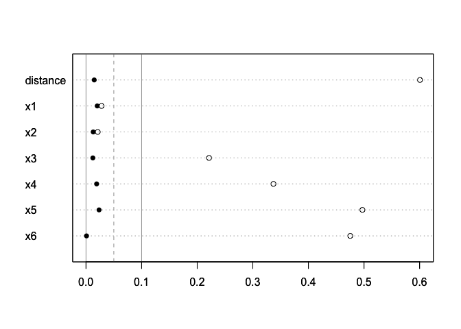
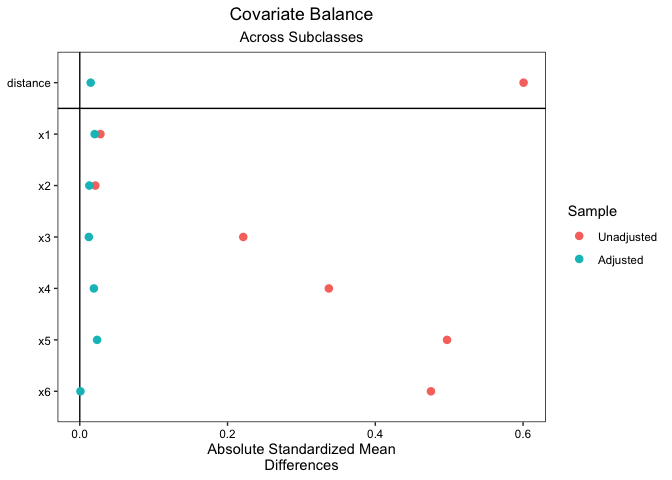

# chapter12_傾向スコアによる層化解析法及び重み付け法：ATE の推定


## 前準備

``` r
library(tidyverse)
```

    ── Attaching core tidyverse packages ──────────────────────── tidyverse 2.0.0 ──
    ✔ dplyr     1.1.4     ✔ readr     2.1.5
    ✔ forcats   1.0.0     ✔ stringr   1.5.1
    ✔ ggplot2   3.5.1     ✔ tibble    3.2.1
    ✔ lubridate 1.9.3     ✔ tidyr     1.3.1
    ✔ purrr     1.0.2     
    ── Conflicts ────────────────────────────────────────── tidyverse_conflicts() ──
    ✖ dplyr::filter() masks stats::filter()
    ✖ dplyr::lag()    masks stats::lag()
    ℹ Use the conflicted package (<http://conflicted.r-lib.org/>) to force all conflicts to become errors

``` r
data11 <- read_csv("https://raw.githubusercontent.com/mtakahashi123/causality/main/data11.csv")
```

    Rows: 1000 Columns: 10
    ── Column specification ────────────────────────────────────────────────────────
    Delimiter: ","
    dbl (10): y0t, y1t, y3, t1, x1, x2, x3, x4, x5, x6

    ℹ Use `spec()` to retrieve the full column specification for this data.
    ℹ Specify the column types or set `show_col_types = FALSE` to quiet this message.

## 傾向スコアによる層化解析法

### 層化解析法とは

層ごとの平均処置効果の統合

$$
\hat{\tau}_{ATE} = \sum_{k=1}^{K} \frac{n_k}{N} \left[ \bar{Y}_k(1) - \bar{Y}_k(0) \right]
$$

層ごとの分散の統合

$$
\mathrm{var}[\hat{\tau}_{ATE}] = \sum_{k=1}^{K} \left( \frac{n_k}{N} \right)^2 {\mathrm{var} \left[ \bar{Y}_k(1) - \bar{Y}_k(0) \right]}
$$

### R による傾向スコア層化解析：ATE の推定

ATE の真値は `3.756`

``` r
data11 |> pull(y1t) |> mean() - data11 |> pull(y0t) |> mean()
```

    [1] 3.755947

#### 傾向スコアのモデル化

``` r
library(MatchIt)

sub <- 5
m.out2 <- MatchIt::matchit(formula = t1 ~ x1 + x2 + x3 + x4 + x5 + x6,
                           data = data11,
                           method = "subclass",
                           subclass = sub,
                           estimand = "ATE",
                           min.n = 2
                           )
m.data2 <- MatchIt::match.data(m.out2)
```

#### 傾向スコア層化解析による ATE の推定

``` r
library(lmtest)
```

    Loading required package: zoo


    Attaching package: 'zoo'

    The following objects are masked from 'package:base':

        as.Date, as.Date.numeric

``` r
library(sandwich)

psp <- NULL
psvar <- NULL
nps <- NULL
robustvar <- NULL

for(j in 1:sub) {
  dataps <- m.data2[m.data2$subclass == j, ]
  model4 <- lm(y3 ~ t1 + x1 + x2 + x3 + x4 + x5 + x6, data = dataps)
  psp[j] <- summary(model4)$coefficients[2, 1]
  psvar[j] <- summary(model4)$coefficients[2, 2]^2
  nps[j] <- nrow(dataps)
  robustvar[j] <- lmtest::coeftest(model4, vcov. = sandwich::vcovCL, cluster = ~ weights)[2, 2]
}

psp
```

    [1] 8.2114114 4.4809301 3.8157096 2.1218324 0.1144802

``` r
psvar
```

    [1] 0.4013066 0.5674602 0.4879605 0.4931660 0.4106398

``` r
nps
```

    [1] 200 200 200 200 200

``` r
robustvar
```

    [1] 0.2943865 0.4497133 0.4868898 0.6962178 0.8831411

``` r
n1 <- nrow(data11)
tauhat <- sum((nps / n1) * psp)
vartau <- sum((nps / n1)^2 * psvar)
setau <- sqrt(vartau)
robustvartau <- sum((nps / n1)^2 * robustvar)
robustsetau <- sqrt(robustvartau)

tauhat
```

    [1] 3.748873

``` r
setau
```

    [1] 0.3072805

``` r
robustsetau
```

    [1] 0.3352819

``` r
tstar <- qt(0.975, n1 - 8)
tauhat - tstar * robustsetau
```

    [1] 3.09093

``` r
tauhat + tstar * robustsetau
```

    [1] 4.406816

## 傾向スコアによるバランシングの評価

``` r
summary(m.out2)
```


    Call:
    MatchIt::matchit(formula = t1 ~ x1 + x2 + x3 + x4 + x5 + x6, 
        data = data11, method = "subclass", estimand = "ATE", subclass = sub, 
        min.n = 2)

    Summary of Balance for All Data:
             Means Treated Means Control Std. Mean Diff. Var. Ratio eCDF Mean
    distance        0.4371        0.3584          0.6007     0.9897    0.1755
    x1              0.9655        0.9919         -0.0280     0.7966    0.0210
    x2              0.9596        0.9810         -0.0211     0.8841    0.0200
    x3              1.1451        0.9162          0.2213     1.0303    0.0616
    x4              1.2246        0.8986          0.3371     0.9352    0.1017
    x5              1.2874        0.7913          0.4971     1.0065    0.1461
    x6              1.2896        0.8382          0.4753     0.9166    0.1376
             eCDF Max
    distance   0.3232
    x1         0.0540
    x2         0.0524
    x3         0.1002
    x4         0.1797
    x5         0.2387
    x6         0.2212

    Summary of Balance Across Subclasses
             Means Treated Means Control Std. Mean Diff. Var. Ratio eCDF Mean
    distance        0.3902        0.3882          0.0148     1.0303    0.0095
    x1              0.9917        0.9727          0.0202     0.7583    0.0190
    x2              0.9844        0.9713          0.0129     0.9283    0.0213
    x3              1.0157        1.0030          0.0123     1.0600    0.0107
    x4              1.0413        1.0228          0.0191     0.9487    0.0205
    x5              0.9994        0.9760          0.0235     1.0893    0.0100
    x6              1.0112        1.0121         -0.0009     0.9771    0.0083
             eCDF Max
    distance   0.0339
    x1         0.0536
    x2         0.0474
    x3         0.0408
    x4         0.0553
    x5         0.0324
    x6         0.0328

    Sample Sizes:
                  Control Treated
    All            611.       389
    Matched (ESS)  570.38     325
    Matched        611.       389
    Unmatched        0.         0
    Discarded        0.         0

``` r
diffa <- abs(summary(m.out2)$sum.all[ , 3])
diffb <- abs(summary(m.out2)$sum.across[ , 3])
diff1 <- rev(diffa)
diff2 <- rev(diffb)
maxx <- max(diff1, diff2)
labels0 <- rownames(summary(m.out2)$sum.all)
labels1 <- rev(labels0)
dotchart(diff1,    xlim = c(0, maxx), labels = c(labels1))
abline(v = 0.00, col = 8)
abline(v = 0.10, col = 8)
abline(v = 0.05, lty = 2, col = 8)
par(new = TRUE)
dotchart(diff2, xlim = c(0, maxx), labels = c(labels1), pch = 16)
```



``` r
library(cobalt)
```

     cobalt (Version 4.5.5, Build Date: 2024-04-02)


    Attaching package: 'cobalt'

    The following object is masked from 'package:MatchIt':

        lalonde

``` r
cobalt::love.plot(m.out2, abs = TRUE)
```



## 傾向スコアによる重み付け法

### R による傾向スコアの重み付け法：ATE の推定

$T_i$ は処置の割付けを表す二値変数、 $\hat{e}_i$
はモデルから計算された傾向スコアを表す。

$$
w_i = \frac{T_i}{\hat{e}_i} + \frac{1 - T_i}{1 - \hat{e}_i}
$$

#### 傾向スコアのモデル化と重みの計算

``` r
model1 <- data11 |>
  glm(t1 ~ x1 + x2 + x3 + x4 + x5 + x6, data = _, family = binomial(link = "logit"))

ps1 <- model1$fitted.values
if1 <- data11$t1 == 1
if0 <- data11$t1 == 0
weights1 <- NULL
weights1[if1] <- 1 / ps1[if1]
weights1[if0] <- 1 / (1 - ps1[if0])
```

``` r
model2 <- data11 |>
  lm(y3 ~ t1, data = _, weights = weights1)

model3 <- data11 |>
  lm(y3 ~ t1 + x1 + x2 + x3 + x4 + x5 + x6, data = _, weights = weights1)

summary(model2)
```


    Call:
    lm(formula = y3 ~ t1, data = data11, weights = weights1)

    Weighted Residuals:
         Min       1Q   Median       3Q      Max 
    -152.747  -20.343   -3.165   23.383  141.085 

    Coefficients:
                Estimate Std. Error t value Pr(>|t|)    
    (Intercept)   31.852      1.064  29.949   <2e-16 ***
    t1             3.202      1.506   2.126   0.0338 *  
    ---
    Signif. codes:  0 '***' 0.001 '**' 0.01 '*' 0.05 '.' 0.1 ' ' 1

    Residual standard error: 33.72 on 998 degrees of freedom
    Multiple R-squared:  0.004507,  Adjusted R-squared:  0.003509 
    F-statistic: 4.518 on 1 and 998 DF,  p-value: 0.03379

``` r
summary(model3)
```


    Call:
    lm(formula = y3 ~ t1 + x1 + x2 + x3 + x4 + x5 + x6, data = data11, 
        weights = weights1)

    Weighted Residuals:
         Min       1Q   Median       3Q      Max 
    -21.8807  -4.8375  -0.6488   4.2582  24.8036 

    Coefficients:
                Estimate Std. Error t value Pr(>|t|)    
    (Intercept)   1.3572     0.3411   3.979 7.44e-05 ***
    t1            3.8162     0.3111  12.265  < 2e-16 ***
    x1            1.5375     0.1909   8.054 2.29e-15 ***
    x2            0.4537     0.1976   2.296 0.021872 *  
    x3           -0.7651     0.1976  -3.871 0.000115 ***
    x4            7.6402     0.2079  36.745  < 2e-16 ***
    x5            9.6782     0.1952  49.576  < 2e-16 ***
    x6           11.2605     0.1872  60.166  < 2e-16 ***
    ---
    Signif. codes:  0 '***' 0.001 '**' 0.01 '*' 0.05 '.' 0.1 ' ' 1

    Residual standard error: 6.964 on 992 degrees of freedom
    Multiple R-squared:  0.9578,    Adjusted R-squared:  0.9575 
    F-statistic:  3216 on 7 and 992 DF,  p-value: < 2.2e-16

#### 標準誤差について

逆確率重み付け法では、各々の個体が異なる重みを持ち得るため、重み付けしたデータセットではクラスターが発生する可能性がある。したがって、クラスターに頑健な標準誤差を用いる。

``` r
library(lmtest)
library(sandwich)

lmtest::coeftest(model3, vcov. = sandwich::vcovCL, cluster = weights1)
```


    t test of coefficients:

                Estimate Std. Error t value  Pr(>|t|)    
    (Intercept)  1.35717    0.33392  4.0644 5.196e-05 ***
    t1           3.81621    0.33429 11.4158 < 2.2e-16 ***
    x1           1.53750    0.20548  7.4826 1.604e-13 ***
    x2           0.45370    0.27432  1.6539   0.09846 .  
    x3          -0.76509    0.33413 -2.2898   0.02224 *  
    x4           7.64019    0.22576 33.8416 < 2.2e-16 ***
    x5           9.67820    0.22117 43.7590 < 2.2e-16 ***
    x6          11.26049    0.19145 58.8166 < 2.2e-16 ***
    ---
    Signif. codes:  0 '***' 0.001 '**' 0.01 '*' 0.05 '.' 0.1 ' ' 1

``` r
coefci(model3, level = 0.95, vcov. = sandwich::vcovCL, cluster = weights1)
```

                      2.5 %     97.5 %
    (Intercept)  0.70190675  2.0124349
    t1           3.16021149  4.4722170
    x1           1.13427703  1.9407150
    x2          -0.08460953  0.9920089
    x3          -1.42077478 -0.1094031
    x4           7.19715916  8.0832163
    x5           9.24418729 10.1122198
    x6          10.88479193 11.6361817

重み付け方として傾向スコアを用いる場合には、傾向スコアの予測値が正確であることが求められる。
