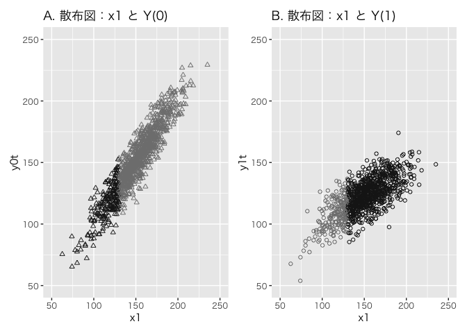
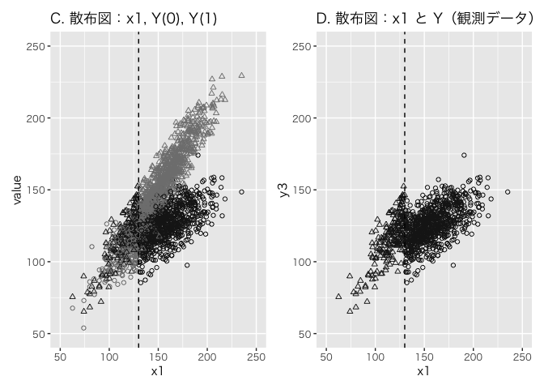
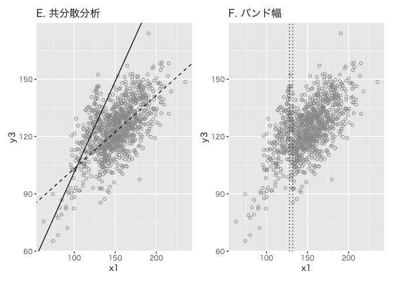
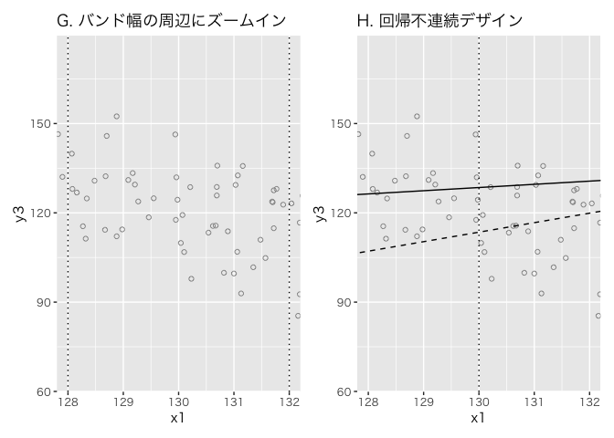

# chapter15_回帰不連続デザインの基礎


## 前準備

``` r
library(tidyverse)
```

    ── Attaching core tidyverse packages ──────────────────────── tidyverse 2.0.0 ──
    ✔ dplyr     1.1.4     ✔ readr     2.1.5
    ✔ forcats   1.0.0     ✔ stringr   1.5.1
    ✔ ggplot2   3.5.1     ✔ tibble    3.2.1
    ✔ lubridate 1.9.3     ✔ tidyr     1.3.1
    ✔ purrr     1.0.2     
    ── Conflicts ────────────────────────────────────────── tidyverse_conflicts() ──
    ✖ dplyr::filter() masks stats::filter()
    ✖ dplyr::lag()    masks stats::lag()
    ℹ Use the conflicted package (<http://conflicted.r-lib.org/>) to force all conflicts to become errors

``` r
library(patchwork)
library(broom)

DATA15 <- "https://raw.githubusercontent.com/mtakahashi123/causality/main/data15.csv"
data15 <- read_csv(DATA15)
```

    Rows: 1000 Columns: 5
    ── Column specification ────────────────────────────────────────────────────────
    Delimiter: ","
    dbl (5): y0t, y1t, y3, t1, x1

    ℹ Use `spec()` to retrieve the full column specification for this data.
    ℹ Specify the column types or set `show_col_types = FALSE` to quiet this message.

``` r
p1 <- data15 |>
  mutate(
    c = factor(if_else(x1 < 130, 1, 0))
  ) |>
  ggplot(aes(x = x1, y = y0t, color = c)) +
  geom_point(shape = 2) +
  scale_color_manual(values = c("gray50", "gray10")) +
  coord_cartesian(xlim = c(50, 250), ylim = c(50, 250)) +
  labs(title = "A. 散布図：x1 と Y(0)") +
  theme(legend.position = "none", text = element_text(family = "Hiragino Sans"))

p2 <- data15 |>
  mutate(
    c = factor(if_else(x1 < 130, 1, 0))
  ) |>
  ggplot(aes(x = x1, y = y1t, color = c)) +
  geom_point(shape = 1) +
  scale_color_manual(values = c("gray10", "gray50")) +
  coord_cartesian(xlim = c(50, 250), ylim = c(50, 250)) +
  labs(title = "B. 散布図：x1 と Y(1)") +
  theme(legend.position = "none", text = element_text(family = "Hiragino Sans"))

p1 + p2
```



``` r
p3 <- data15 |>
  mutate(
    c = if_else(x1 < 130, 1, 0)
  ) |>
  select(y0t, y1t, c, x1) |>
  pivot_longer(
    cols = c(y0t, y1t)
  ) |>
  mutate(
    flg = case_when(
      c == 0 & name == "y0t" ~ "A0",
      c == 1 & name == "y0t" ~ "A1",
      c == 0 & name == "y1t" ~ "B0",
      c == 1 & name == "y1t" ~ "B1",
    )
  ) |>
  ggplot(aes(x = x1, y = value, color = flg, shape = flg)) +
  geom_point() +
  geom_vline(xintercept = 130, linetype = "dashed") +
  scale_color_manual(values = c("gray50", "gray10", "gray10", "gray50")) +
  scale_shape_manual(values = c(2, 2, 1, 1)) +
  coord_cartesian(xlim = c(50, 250), ylim = c(50, 250)) +
  labs(title = "C. 散布図：x1, Y(0), Y(1)") +
  theme(legend.position = "none", text = element_text(family = "Hiragino Sans"))

p4 <- data15 |>
  mutate(
    c = factor(if_else(x1 < 130, 1, 0))
  ) |>
  ggplot(aes(x = x1, y = y3, color = c, shape = c)) +
  geom_point() +
  geom_vline(xintercept = 130, linetype = "dashed") +
  scale_color_manual(values = c("gray10", "gray10")) +
  scale_shape_manual(values = c(1, 2)) +
  coord_cartesian(xlim = c(50, 250), ylim = c(50, 250)) +
  labs(title = "D. 散布図：x1 と Y（観測データ）") +
  theme(legend.position = "none", text = element_text(family = "Hiragino Sans"))

p3 + p4
```



## 平均処置効果と共分散分析

``` r
data15 |>
  summarise(
    mean(y1t),
    mean(y0t),
    mean(y1t) - mean(y0t),
  )
```

    # A tibble: 1 × 3
      `mean(y1t)` `mean(y0t)` `mean(y1t) - mean(y0t)`
            <dbl>       <dbl>                   <dbl>
    1        122.        151.                   -29.0

``` r
data15 |> filter(t1 == 1) |> pull(y3) |> mean()
```

    [1] 126.0031

``` r
data15 |> filter(t1 == 0) |> pull(y3) |> mean()
```

    [1] 115.6725

``` r
data15 |> filter(t1 == 1) |> pull(y3) |> mean() - data15 |> filter(t1 == 0) |> pull(y3) |> mean()
```

    [1] 10.33062

共分散分析

``` r
modelA <- data15 |> lm(y3 ~ t1 + x1, data = _)
summary(modelA)
```


    Call:
    lm(formula = y3 ~ t1 + x1, data = data15)

    Residuals:
        Min      1Q  Median      3Q     Max 
    -37.384  -6.996   0.296   7.410  34.246 

    Coefficients:
                Estimate Std. Error t value Pr(>|t|)    
    (Intercept) 64.62053    2.32272  27.821  < 2e-16 ***
    t1          -9.38949    1.20196  -7.812 1.42e-14 ***
    x1           0.44397    0.01908  23.264  < 2e-16 ***
    ---
    Signif. codes:  0 '***' 0.001 '**' 0.01 '*' 0.05 '.' 0.1 ' ' 1

    Residual standard error: 10.82 on 997 degrees of freedom
    Multiple R-squared:  0.4084,    Adjusted R-squared:  0.4072 
    F-statistic: 344.1 on 2 and 997 DF,  p-value: < 2.2e-16

処置を受けた場合を受けなかった場合で関数形が行なっているため、実際の平均処置効果
`-28.974` と大幅に異なる結果となった。

## 閾値における局所的な平均処置効果

閾値における局所的な平均処置効果（LATE: local average treatment effect
at the cutoff）とは、共変量 $X_i$ が閾値 $c$ の値を取るときの $Y_i(1)$
と $Y_i(0)$ の差の期待値である。

$$
\mathbb{E}[Y_i(1) - Y_i(0) | X_i = c] = \mathbb{E}[Y_i(1)|X_i=c] - \mathbb{E}[Y_i(0)|X_i=c]
$$

## 回帰不連続デザインによる分析

局所線形回帰モデルでは、バンド幅（bandwidth）を設定し、閾値の周辺（
$c \pm h$
）において、閾値の左側と右側にそれぞれ別々の線形回帰モデルを当てはめる。

局所的な平均処置効果（LATE）

``` r
data15 |>
  mutate(
    h1 = 128 < x1 & x1 <= 132
  ) |>
  filter(h1) |>
  summarize(
    late = mean(y1t) - mean(y0t)
  ) |>
  pull(late)
```

    [1] -13.09745

回帰不連続デザイン

``` r
modelR <- data15 |>
  mutate(
    h1 = 128 < x1 & x1 <= 132
  ) |>
  filter(h1) |>
  mutate(
    tx1 = t1 * x1
  ) |>
  lm(y3 ~ t1 + x1 + tx1, data = _)

summary(modelR)
```


    Call:
    lm(formula = y3 ~ t1 + x1 + tx1, data = mutate(filter(mutate(data15, 
        h1 = 128 < x1 & x1 <= 132), h1), tx1 = t1 * x1))

    Residuals:
         Min       1Q   Median       3Q      Max 
    -24.2023  -9.7093   0.1056   7.1535  25.1149 

    Coefficients:
                Estimate Std. Error t value Pr(>|t|)
    (Intercept)  -11.521    521.932  -0.022    0.982
    t1          -289.931    744.626  -0.389    0.699
    x1             1.077      4.047   0.266    0.791
    tx1            2.115      5.729   0.369    0.714

    Residual standard error: 11.97 on 47 degrees of freedom
    Multiple R-squared:  0.1876,    Adjusted R-squared:  0.1357 
    F-statistic: 3.618 on 3 and 47 DF,  p-value: 0.01975

回帰不連続デザインの結果は劇的に間違っているように見えるが、交互作用行を含む回帰モデルにおける処置効果は
$\beta_1 + \beta_3 \mathbb{E}[X_i]$
なので、求めるべき局所的な平均処置効果は $X_i = 130$ の時、
$\hat{\beta}_1 + \hat{\beta}_3 X_i = -289.931 + 2.115 \times 130 = -14.981$
である。よって、局所的な平均処置効果（LATE）をかなり正確に推定できている。

## 回帰不連続デザインの図解

``` r
coefs1 <- model0 <- data15 |> filter(t1 == 0) |> lm(y3 ~ x1, data = _) |> broom::tidy()
coefs2 <- model0 <- data15 |> filter(t1 == 1) |> lm(y3 ~ x1, data = _) |> broom::tidy()

p5 <- ggplot(data15, aes(x = x1, y = y3)) +
  geom_point(shape = 1, color = "gray60") +
  geom_abline(
    slope = coefs1 |> filter(term == "x1") |> pull(estimate),
    intercept = coefs1 |> filter(term == "(Intercept)") |> pull(estimate),
  ) +
  geom_abline(
    slope = coefs2 |> filter(term == "x1") |> pull(estimate),
    intercept = coefs2 |> filter(term == "(Intercept)") |> pull(estimate),
    linetype = "dashed"
  ) +
  labs(title = "E. 共分散分析") +
  theme(text = element_text(family = "Hiragino Sans"))

p6 <- ggplot(data15, aes(x = x1, y = y3)) +
  geom_point(shape = 1, color = "gray60") +
  geom_vline(xintercept = 128, linetype = "dotted") +
  geom_vline(xintercept = 132, linetype = "dotted") +
  labs(title = "F. バンド幅") +
  theme(text = element_text(family = "Hiragino Sans"))

p5 + p6
```



バンド幅の可視化

``` r
coefs3 <- model0 <- data15 |> filter(128 < x1 & x1 < 130) |> lm(y3 ~ x1, data = _) |> broom::tidy()
coefs4 <- model0 <- data15 |> filter(130 < x1 & x1 < 132) |> lm(y3 ~ x1, data = _) |> broom::tidy()

p7 <- data15 |>
  ggplot(aes(x = x1, y = y3)) +
  geom_point(shape = 1, color = "gray60") +
  geom_vline(xintercept = 128, linetype = "dotted") +
  geom_vline(xintercept = 132, linetype = "dotted") +
  labs(title = "G. バンド幅の周辺にズームイン") +
  theme(text = element_text(family = "Hiragino Sans")) +
  coord_cartesian(xlim = c(128, 132))

p8 <- ggplot(data15, aes(x = x1, y = y3)) +
  geom_point(shape = 1, color = "gray60") +
  geom_abline(
    slope = coefs3 |> filter(term == "x1") |> pull(estimate),
    intercept = coefs3 |> filter(term == "(Intercept)") |> pull(estimate),
  ) +
  geom_abline(
    slope = coefs4 |> filter(term == "x1") |> pull(estimate),
    intercept = coefs4 |> filter(term == "(Intercept)") |> pull(estimate),
    linetype = "dashed"
  ) +
  geom_vline(xintercept = 130, linetype = "dotted") +
  labs(title = "H. 回帰不連続デザイン") +
  theme(text = element_text(family = "Hiragino Sans")) +
  coord_cartesian(xlim = c(128, 132))

p7 + p8
```



## 回帰不連続デザインの理論

$$
\tau_{LATE} = \lim_{x \downarrow c} \mathbb{E}[Y_i(1) | X_i = c] - \lim_{x \uparrow c} \mathbb{E}[Y_i(0) | X_i = c]
$$
