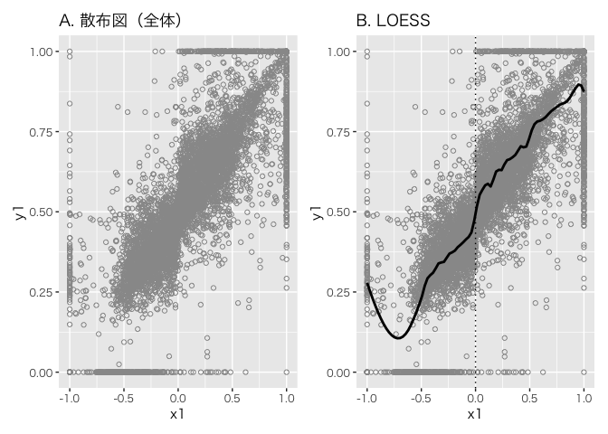
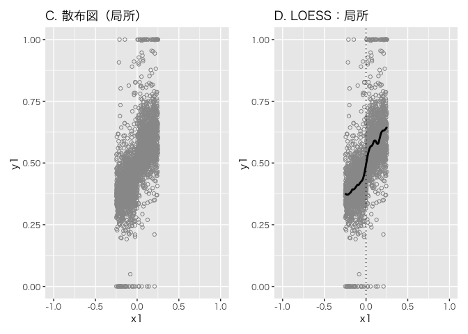
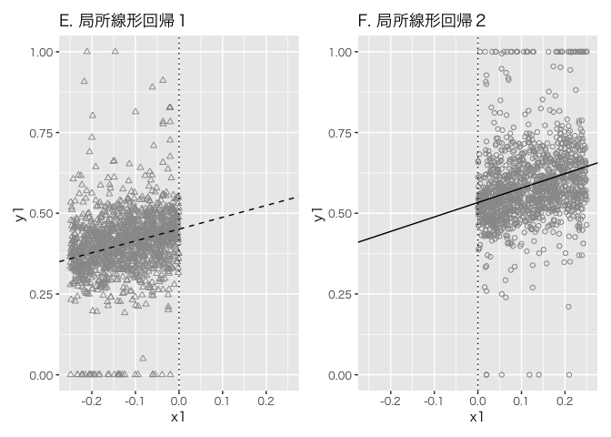
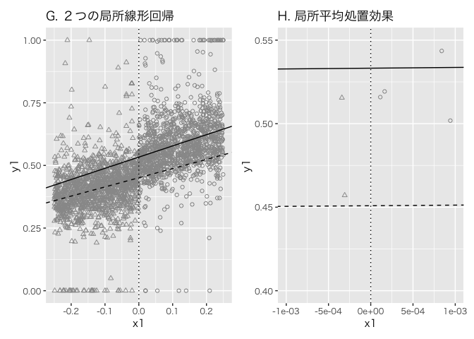
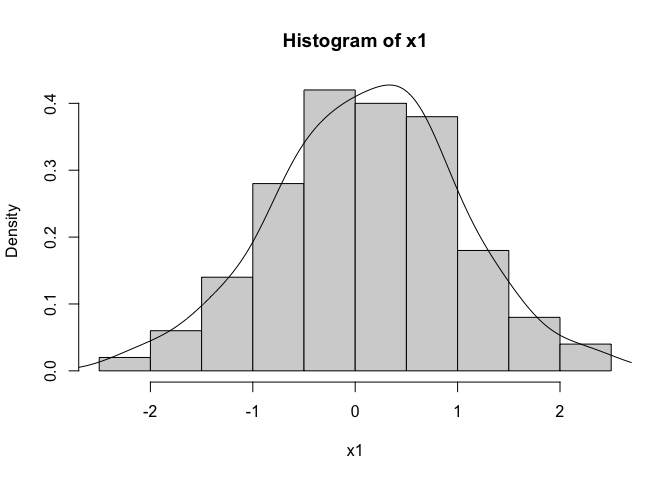
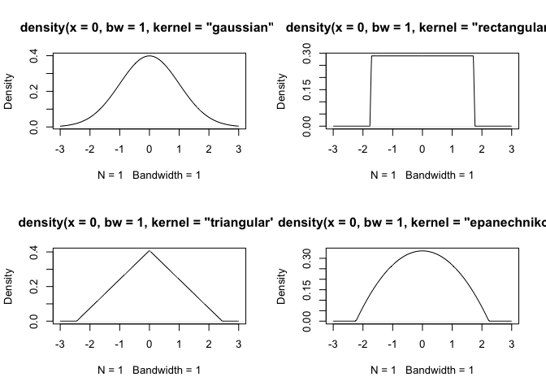
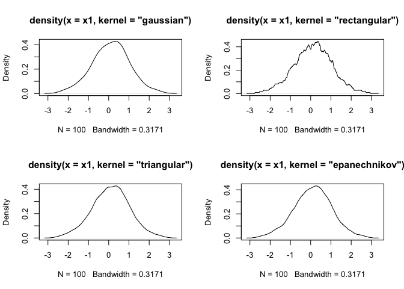
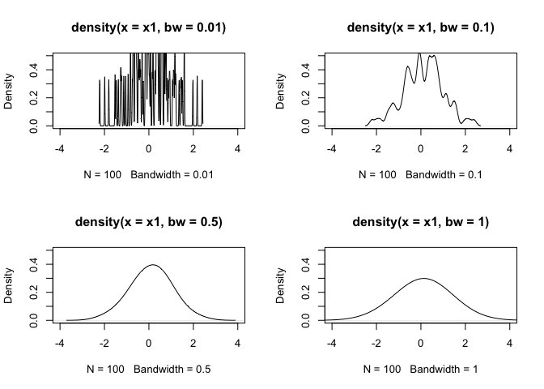
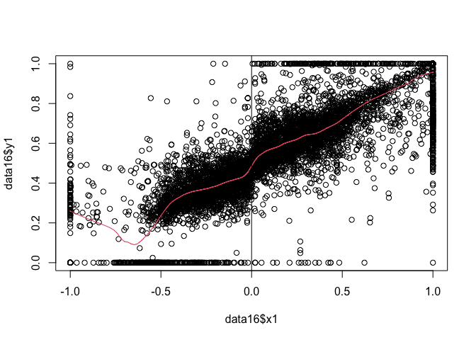
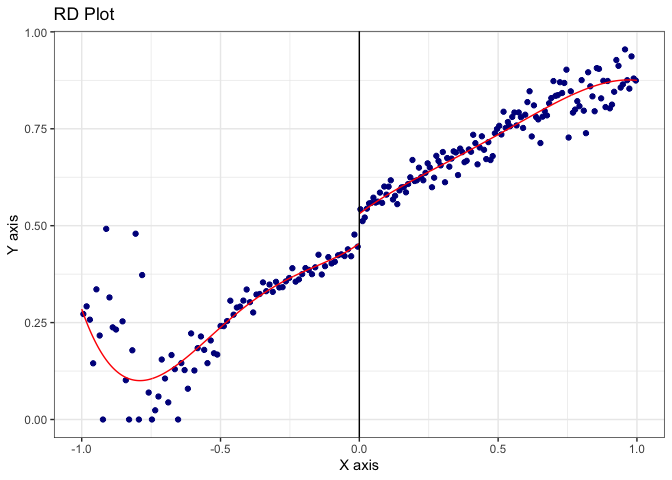

# chapter16_回帰不連続デザインの応用


## 前準備

``` r
library(tidyverse)
```

    ── Attaching core tidyverse packages ──────────────────────── tidyverse 2.0.0 ──
    ✔ dplyr     1.1.4     ✔ readr     2.1.5
    ✔ forcats   1.0.0     ✔ stringr   1.5.1
    ✔ ggplot2   3.5.1     ✔ tibble    3.2.1
    ✔ lubridate 1.9.3     ✔ tidyr     1.3.1
    ✔ purrr     1.0.2     
    ── Conflicts ────────────────────────────────────────── tidyverse_conflicts() ──
    ✖ dplyr::filter() masks stats::filter()
    ✖ dplyr::lag()    masks stats::lag()
    ℹ Use the conflicted package (<http://conflicted.r-lib.org/>) to force all conflicts to become errors

``` r
library(patchwork)
library(broom)

DATA16 <- "https://raw.githubusercontent.com/mtakahashi123/causality/main/data16.csv"
data16 <- read_csv(DATA16)
```

    Rows: 6558 Columns: 2
    ── Column specification ────────────────────────────────────────────────────────
    Delimiter: ","
    dbl (2): y1, x1

    ℹ Use `spec()` to retrieve the full column specification for this data.
    ℹ Specify the column types or set `show_col_types = FALSE` to quiet this message.

``` r
summary(data16)
```

           y1               x1          
     Min.   :0.0000   Min.   :-1.00000  
     1st Qu.:0.3857   1st Qu.:-0.19557  
     Median :0.5401   Median : 0.08314  
     Mean   :0.5511   Mean   : 0.12747  
     3rd Qu.:0.7021   3rd Qu.: 0.41292  
     Max.   :1.0000   Max.   : 1.00000  

``` r
data16a <- data16 |>
  mutate(
    t1 = if_else(x1 <= 0, 0, 1)
  )
```

``` r
c1 <- 0.0

p1 <- data16a |>
  ggplot(aes(x = x1, y = y1)) +
  geom_point(shape = 1, color = "gray60") +
  labs(title = "A. 散布図（全体）") +
  theme(text = element_text(family = "Hiragino Sans"))

p2 <- data16a |>
  ggplot(aes(x = x1, y = y1)) +
  geom_point(shape = 1, color = "gray60") +
  geom_smooth(method = "loess", se = FALSE, span = 0.1, color = "black") +
  geom_vline(xintercept = c1, linetype = "dotted") +
  labs(title = "B. LOESS") +
  theme(text = element_text(family = "Hiragino Sans"))

p1 + p2
```

    `geom_smooth()` using formula = 'y ~ x'



``` r
h1 <- 0.25

p3 <- data16a |>
  filter((c1 - h1) < x1 & x1 < (c1 + h1)) |>
  ggplot(aes(x = x1, y = y1)) +
  geom_point(shape = 1, color = "gray60") +
  scale_x_continuous(limits = c(-1, 1)) +
  labs(title = "C. 散布図（局所）") +
  theme(text = element_text(family = "Hiragino Sans"))

p4 <- data16a |>
  filter((c1 - h1) < x1 & x1 < (c1 + h1)) |>
  ggplot(aes(x = x1, y = y1)) +
  geom_point(shape = 1, color = "gray60") +
  geom_smooth(method = "loess", se = FALSE, span = 0.2, color = "black") +
  geom_vline(xintercept = c1, linetype = "dotted") +
  scale_x_continuous(limits = c(-1, 1)) +
  labs(title = "D. LOESS：局所") +
  theme(text = element_text(family = "Hiragino Sans"))

p3 + p4
```

    `geom_smooth()` using formula = 'y ~ x'



``` r
modelRDD2 <- data16a |> filter((c1 - h1) < x1 & x1 < (c1 + h1) & t1 == 0) |> lm(y1 ~ x1, data = _)
coefsRDD2 <- broom::tidy(modelRDD2)
modelRDD3 <- data16a |> filter((c1 - h1) < x1 & x1 < (c1 + h1) & t1 == 1) |> lm(y1 ~ x1, data = _)
coefsRDD3 <- broom::tidy(modelRDD3)

p5 <- data16a |>
  filter((c1 - h1) < x1 & x1 < (c1 + h1) & t1 == 0) |>
  ggplot(aes(x = x1, y = y1)) +
  geom_point(shape = 2, color = "gray60") +
  geom_abline(
    slope = coefsRDD2 |> filter(term == "x1") |> pull(estimate),
    intercept = coefsRDD2 |> filter(term == "(Intercept)") |> pull(estimate),
    linetype = "dashed"
  ) +
  geom_vline(xintercept = c1, linetype = "dotted") +
  scale_x_continuous(limits = c((c1 - h1), (c1 + h1))) +
  labs(title = "E. 局所線形回帰１") +
  theme(text = element_text(family = "Hiragino Sans"))

p6 <- data16a |>
  filter((c1 - h1) < x1 & x1 < (c1 + h1) & t1 == 1) |>
  ggplot(aes(x = x1, y = y1)) +
  geom_point(shape = 1, color = "gray60") +
  geom_abline(
    slope = coefsRDD3 |> filter(term == "x1") |> pull(estimate),
    intercept = coefsRDD3 |> filter(term == "(Intercept)") |> pull(estimate),
    linetype = "solid"
  ) +
  geom_vline(xintercept = c1, linetype = "dotted") +
  scale_x_continuous(limits = c((c1 - h1), (c1 + h1))) +
  labs(title = "F. 局所線形回帰２") +
  theme(text = element_text(family = "Hiragino Sans"))

p5 + p6
```



``` r
coefsRDD2
```

    # A tibble: 2 × 5
      term        estimate std.error statistic  p.value
      <chr>          <dbl>     <dbl>     <dbl>    <dbl>
    1 (Intercept)    0.451   0.00569     79.2  0       
    2 x1             0.367   0.0405       9.04 5.01e-19

``` r
h2 <- 0.001

p7 <- data16a |>
  filter((c1 - h1) < x1 & x1 < (c1 + h1)) |>
  mutate(t1 = factor(t1)) |>
  ggplot(aes(x = x1, y = y1, shape = t1)) +
  geom_point(color = "gray60") +
  geom_abline(
    slope = coefsRDD2 |> filter(term == "x1") |> pull(estimate),
    intercept = coefsRDD2 |> filter(term == "(Intercept)") |> pull(estimate),
    linetype = "dashed"
  ) +
  geom_abline(
    slope = coefsRDD3 |> filter(term == "x1") |> pull(estimate),
    intercept = coefsRDD3 |> filter(term == "(Intercept)") |> pull(estimate),
    linetype = "solid"
  ) +
  geom_vline(xintercept = c1, linetype = "dotted") +
  scale_shape_manual(values = c(2, 1)) +
  labs(title = "G. ２つの局所線形回帰") +
  theme(text = element_text(family = "Hiragino Sans"), legend.position = "none")

p8 <- data16a |>
  filter((c1 - h1) < x1 & x1 < (c1 + h1)) |>
  mutate(t1 = factor(t1)) |>
  ggplot(aes(x = x1, y = y1, shape = t1)) +
  geom_point(color = "gray60") +
  geom_abline(
    slope = coefsRDD2 |> filter(term == "x1") |> pull(estimate),
    intercept = coefsRDD2 |> filter(term == "(Intercept)") |> pull(estimate),
    linetype = "dashed"
  ) +
  geom_abline(
    slope = coefsRDD3 |> filter(term == "x1") |> pull(estimate),
    intercept = coefsRDD3 |> filter(term == "(Intercept)") |> pull(estimate),
    linetype = "solid"
  ) +
  geom_vline(xintercept = c1, linetype = "dotted") +
  scale_shape_manual(values = c(2, 1)) +
  scale_x_continuous(limits = c((c1 - h2), (c1 + h2))) +
  scale_y_continuous(limits = c(0.4, 0.55)) +
  labs(title = "H. 局所平均処置効果") +
  theme(text = element_text(family = "Hiragino Sans"), legend.position = "none")

p7 + p8
```

    Warning: Removed 2757 rows containing missing values or values outside the scale range
    (`geom_point()`).



## 数値による分析

``` r
library(lmtest)
```

    Loading required package: zoo


    Attaching package: 'zoo'

    The following objects are masked from 'package:base':

        as.Date, as.Date.numeric

``` r
library(sandwich)

modelRDD <- data16a |>
  mutate(
    tx1 = t1 * x1
  ) |>
  filter((c1 - h1) < x1 & x1 < (c1 + h1)) |>
  lm(formula = y1 ~ t1 + x1 + tx1, data = _)

lmtest::coeftest(modelRDD, vcov. = sandwich::vcovCL)
```


    t test of coefficients:

                 Estimate Std. Error t value Pr(>|t|)    
    (Intercept) 0.4508738  0.0055777 80.8345   <2e-16 ***
    t1          0.0823459  0.0083868  9.8185   <2e-16 ***
    x1          0.3665293  0.0413393  8.8664   <2e-16 ***
    tx1         0.0806073  0.0630544  1.2784   0.2012    
    ---
    Signif. codes:  0 '***' 0.001 '**' 0.01 '*' 0.05 '.' 0.1 ' ' 1

``` r
lmtest::coefci(modelRDD, vcov. = sandwich::vcovCL)
```

                      2.5 %     97.5 %
    (Intercept)  0.43993684 0.46181077
    t1           0.06590076 0.09879099
    x1           0.28547013 0.44758850
    tx1         -0.04303136 0.20424597

交互作用行を含む回帰モデルにおける処置効果は
$\beta_1 + \beta_3 \mathbb{E}[X_i]$ 。ここで、閾値 $c = 0$
より、閾値における強制変数 $X_i$ の値は `0`
である。すなわち、式一意おける局所的な平均処置効果は、
$\beta_1 + \beta_3 \times 0 = \beta_1$ 。

局所の範囲内の観測数

``` r
data16b <- data16a |> 
  mutate(
    bin1 = (c1 - h1) < x1 & x1 < (c1 + h1),
    bin2 = (c1 - h1) < x1 & x1 < c1,
    bin3 = c1 < x1 & x1 < (c1 + h1),
  )

data16b |> filter(bin1) |> summarize(n = n()) |> pull(n)
```

    [1] 2763

``` r
data16b |> filter(bin2) |> summarize(n = n()) |> pull(n)
```

    [1] 1376

``` r
data16b |> filter(bin3) |> summarize(n = n()) |> pull(n)
```

    [1] 1387

## R パッケージ `rdrobust` による解析：基本編

``` r
library(rdrobust)

modelRDD4 <- rdrobust::rdrobust(data16b$y1, data16b$x1, c = c1, h = h1, kernel = "uniform")
summary(modelRDD4)
```

    Sharp RD estimates using local polynomial regression.

    Number of Obs.                 6558
    BW type                      Manual
    Kernel                      Uniform
    VCE method                       NN

    Number of Obs.                 2740         3818
    Eff. Number of Obs.            1376         1387
    Order est. (p)                    1            1
    Order bias  (q)                   2            2
    BW est. (h)                   0.250        0.250
    BW bias (b)                   0.250        0.250
    rho (h/b)                     1.000        1.000
    Unique Obs.                    2740         3818

    =============================================================================
            Method     Coef. Std. Err.         z     P>|z|      [ 95% C.I. ]       
    =============================================================================
      Conventional     0.082     0.008    10.165     0.000     [0.066 , 0.098]     
            Robust         -         -     5.903     0.000     [0.046 , 0.092]     
    =============================================================================

## カーネル密度推定

ある $x$ の値に対して、以下の指揮により密度推定値を計算する。ここで、
$x_i$ は $n$ 個のデータの値、 $K(\cdot)$ は最頻値が `0` で面積が $1$
の対象な密度関数、 $h$ はウィンドウ幅（バンド幅）である。

$$
\hat{p}(x) = \frac{1}{nh} \sum_{i=1}^{n} {K \left( \frac{x - x_i}{h} \right)}
$$

``` r
set.seed(1)
x1 <- rnorm(n = 100)
hist(x1, freq = FALSE)
lines(density(x1))
```



``` r
layout(matrix(1:4, 2, 2, byrow = TRUE))
plot(density(0, bw = 1, kernel = "gaussian"))
plot(density(0, bw = 1, kernel = "rectangular"))
plot(density(0, bw = 1, kernel = "triangular"))
plot(density(0, bw = 1, kernel = "epanechnikov"))
```



``` r
layout(matrix(1:4, 2, 2, byrow = TRUE))
plot(density(x1, kernel = "gaussian"))
plot(density(x1, kernel = "rectangular"))
plot(density(x1, kernel = "triangular"))
plot(density(x1, kernel = "epanechnikov"))
```



``` r
layout(matrix(1:4, 2, 2, byrow = TRUE))
plot(density(x1, bw = 0.01), xlim = c(-4, 4), ylim = c(0, 0.5))
plot(density(x1, bw = 0.10), xlim = c(-4, 4), ylim = c(0, 0.5))
plot(density(x1, bw = 0.50), xlim = c(-4, 4), ylim = c(0, 0.5))
plot(density(x1, bw = 1.00), xlim = c(-4, 4), ylim = c(0, 0.5))
```



## カーネル関数の選択

どのカーネル関数 $K(\cdot)$ を選択するかはあまり大きな問題ではない。

閾値 $c$ 、バンド幅を決める定数を $h$ とすると、バンド幅は $c \pm h$
となる。このバンド幅の中に入るデータ $x_i$ を以下の式の $w_i$
にしたがって重み付けする。

$$
w_i = K \left( \frac{x_i - c}{h} \right)
$$

重みを利用すると、バンド幅の外の値の重みはゼロになる（ガウス関数を使う場合はバンド幅の外の値の重みをゼロにすることは難しいため、回帰不連続デザインではあまり使用されない）。どのカーネル関数においても、閾値
$c$
の位置で重みが最大になる。矩形関数を用いた場合は、バンド幅内の全ての値に等しい重みをつける。

## バンド幅の選択

バンド幅の選択は、回帰不連続デザインにおける重要事項である。平均二乗誤差（MSE:
mean squared
error）は偏りとばらつきのバランスをとった指標と理解できるので、これが最も小さい推定量を、最も良い推定量とみなす。

$$
MSE(\hat{\theta}) = \mathbb{E}[(\hat{\theta} - \theta)^2]
$$

カーネル密度推定量を $\hat{p}$ とし MSE に応用すると以下になる。

$$
MSE[\hat{p}(x)] = \mathbb{E}[ \left\{ \hat{p}(x) - p(x) \right\}^2 ]
$$

以下を平均積分二乗誤差（MISE: mean integrated squared
error）といい、カーネル密度推定を行う場合には、 MISE を最小化する
$\hat{p}(x)$ が最も良いとみなされる。

$$
MISE[\hat{p}(x)] = \mathbb{E}\left[ \int_{-\infty}^{\infty} {[\hat{p}(x) - p(x)]^2} \mathrm{d}x \right]
$$

一方で、回帰不連続デザインのバンド幅の選択の際には、 MISE よりも MSE
の方が適切であると言われている。MSE の意味で最適なバンド幅
$\hat{h}_{opt}$ は以下のように提案されており、IK バンド幅（IK
bandwidth）と呼ばれている。 $C_k$
はカーネルの関数から計算される定数であり、 $N$
はデータ全体の個数とする。

$$
\hat{h}_{opt} = C_k \left( \frac{\hat{\sigma}_{-}^2(c) + \hat{\sigma}_{+}^2(c)}{ \hat{f}(c) \left(\hat{m}_{+}^{(2)}(c) - \hat{m}_{-}^{(2)}(c)\right)^2 + \hat{r}_{-} + \hat{r}_{+}} \right)^\frac{1}{5} N^{-\frac{1}{5}}
$$

R パッケージ `rdrobust` による IK バンド幅の推定

``` r
IKband <- rdrobust::rdbwselect_2014(y = data16$y1, x = data16$x1, c = 0, bwselect = "IK")
IKband$bws
```

                 h         b
    [1,] 0.2265899 0.2507395

``` r
modelRDD5 <- rdrobust::rdrobust(y = data16$y1, x = data16$x1, c = 0, h = IKband$bws[1, 1])
summary(modelRDD5)
```

    Sharp RD estimates using local polynomial regression.

    Number of Obs.                 6558
    BW type                      Manual
    Kernel                   Triangular
    VCE method                       NN

    Number of Obs.                 2740         3818
    Eff. Number of Obs.            1264         1273
    Order est. (p)                    1            1
    Order bias  (q)                   2            2
    BW est. (h)                   0.227        0.227
    BW bias (b)                   0.227        0.227
    rho (h/b)                     1.000        1.000
    Unique Obs.                    2740         3818

    =============================================================================
            Method     Coef. Std. Err.         z     P>|z|      [ 95% C.I. ]       
    =============================================================================
      Conventional     0.076     0.009     8.520     0.000     [0.058 , 0.093]     
            Robust         -         -     4.972     0.000     [0.037 , 0.086]     
    =============================================================================

MSE
の意味で最適なバンド幅を使った場合、信頼区間の大きさが不適切になることが指摘されている。カバー率の誤差（coverage
error）の意味で最適なバンド幅を用いることで偏りを是正し適切な信頼区間を構築する方法が提案されている。

R パッケージ `rdrobust` による CER（coverage error rate regression）

``` r
modelRDD6 <- rdrobust::rdrobust(y = data16$y1, x = data16$x1, c = 0, bwselect = "cerrd")
summary(modelRDD6)
```

    Sharp RD estimates using local polynomial regression.

    Number of Obs.                 6558
    BW type                       cerrd
    Kernel                   Triangular
    VCE method                       NN

    Number of Obs.                 2740         3818
    Eff. Number of Obs.             504          557
    Order est. (p)                    1            1
    Order bias  (q)                   2            2
    BW est. (h)                   0.087        0.087
    BW bias (b)                   0.239        0.239
    rho (h/b)                     0.362        0.362
    Unique Obs.                    2606         3209

    =============================================================================
            Method     Coef. Std. Err.         z     P>|z|      [ 95% C.I. ]       
    =============================================================================
      Conventional     0.059     0.013     4.524     0.000     [0.033 , 0.085]     
            Robust         -         -     4.154     0.000     [0.030 , 0.084]     
    =============================================================================

## RD プロット

``` r
plot(data16$x1, data16$y1, xlim = c(-1, 1), ylim = c(0, 1))
lines(lowess(data16$x1, data16$y1, f = 0.1), col = 2)
abline(v = 0)
```



``` r
rdp1 <- rdrobust::rdplot(y = data16$y1, x = data16$x1, c = 0)
```



``` r
summary(rdp1)
```

    Call: rdplot

    Number of Obs.                 6558
    Kernel                      Uniform

    Number of Obs.                 2740            3818
    Eff. Number of Obs.            2740            3818
    Order poly. fit (p)               4               4
    BW poly. fit (h)              1.000           1.000
    Number of bins scale              1               1

    Bins Selected                    85             128
    Average Bin Length            0.012           0.008
    Median Bin Length             0.012           0.008

    IMSE-optimal bins                20              17
    Mimicking Variance bins          85             128

    Relative to IMSE-optimal:
    Implied scale                 4.250           7.529
    WIMSE variance weight         0.013           0.002
    WIMSE bias weight             0.987           0.998
