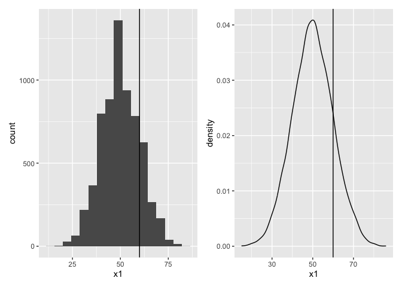
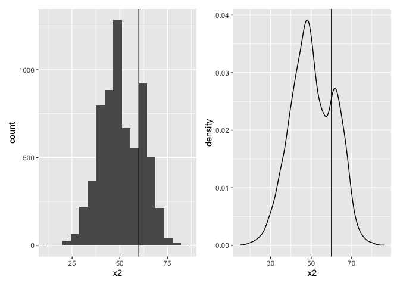
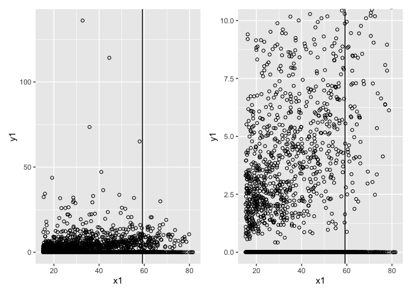
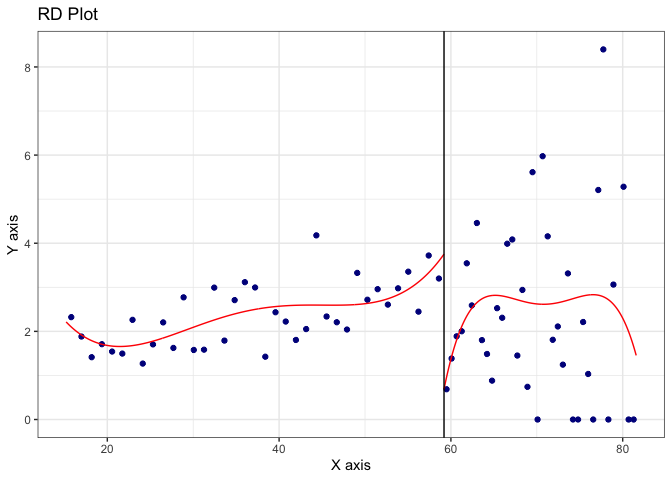
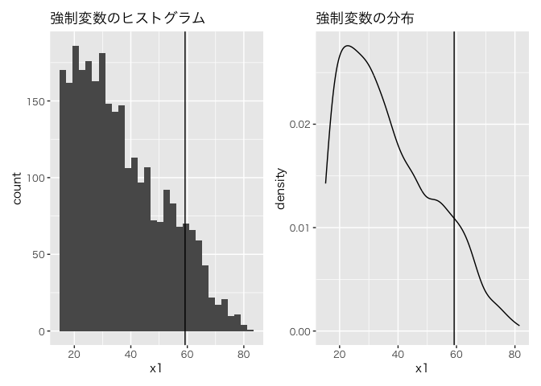

# chapter17_回帰不連続デザインの仮定および実践


## 前準備

``` r
library(tidyverse)
```

    ── Attaching core tidyverse packages ──────────────────────── tidyverse 2.0.0 ──
    ✔ dplyr     1.1.4     ✔ readr     2.1.5
    ✔ forcats   1.0.0     ✔ stringr   1.5.1
    ✔ ggplot2   3.5.1     ✔ tibble    3.2.1
    ✔ lubridate 1.9.3     ✔ tidyr     1.3.1
    ✔ purrr     1.0.2     
    ── Conflicts ────────────────────────────────────────── tidyverse_conflicts() ──
    ✖ dplyr::filter() masks stats::filter()
    ✖ dplyr::lag()    masks stats::lag()
    ℹ Use the conflicted package (<http://conflicted.r-lib.org/>) to force all conflicts to become errors

``` r
library(patchwork)

DATA17A <- "https://raw.githubusercontent.com/mtakahashi123/causality/main/data17a.csv"
DATA17B <- "https://raw.githubusercontent.com/mtakahashi123/causality/main/data17b.csv"

data17a <- read_csv(DATA17A)
```

    Rows: 6558 Columns: 2
    ── Column specification ────────────────────────────────────────────────────────
    Delimiter: ","
    dbl (2): x1, x2

    ℹ Use `spec()` to retrieve the full column specification for this data.
    ℹ Specify the column types or set `show_col_types = FALSE` to quiet this message.

``` r
data17b <- read_csv(DATA17B)
```

    Rows: 2809 Columns: 11
    ── Column specification ────────────────────────────────────────────────────────
    Delimiter: ","
    dbl (11): y1, x1, z1, z2, z3, z4, z5, z6, z7, z8, z9

    ℹ Use `spec()` to retrieve the full column specification for this data.
    ℹ Specify the column types or set `show_col_types = FALSE` to quiet this message.

## 連続性の仮定と強制変数の操作

回帰不連続デザインの識別性の条件、連続性の仮定は、潜在的結果変数
$\{ Y(0), Y(1) \}$
の条件付き分布に連続性があるという意味である。この仮定が満たされない典型例は、閾値の存在が知られていて強制変数
$X$ の値が操作できる場合である。

### グラフによる連続性の仮定の診断

``` r
summary(data17a)
```

           x1              x2       
     Min.   :15.00   Min.   :15.00  
     1st Qu.:43.00   1st Qu.:43.00  
     Median :50.00   Median :50.00  
     Mean   :49.96   Mean   :50.84  
     3rd Qu.:57.00   3rd Qu.:60.00  
     Max.   :86.00   Max.   :86.00  

強制変数 `x1` には操作は行われておらず、強制変数 `x2`
には操作が行われている。

グラフによる診断１

``` r
p1 <- ggplot(data17a, aes(x = x1)) + geom_histogram(bins = 17) + geom_vline(xintercept = 60)
p2 <- ggplot(data17a, aes(x = x1)) + geom_density() + geom_vline(xintercept = 60)

p1 + p2
```



閾値 `60` の前後には得意な状況は発見されていない。

グラフによる診断２

``` r
p3 <- ggplot(data17a, aes(x = x2)) + geom_histogram(bins = 17) + geom_vline(xintercept = 60)
p4 <- ggplot(data17a, aes(x = x2)) + geom_density() + geom_vline(xintercept = 60)

p3 + p4
```



### フォーマルな検定による連続性の仮定の診断

強制変数の操作の検定

``` r
library(rddensity)

summary(rddensity(data17a$x1, c = 60))
```


    Manipulation testing using local polynomial density estimation.

    Number of obs =       6558
    Model =               unrestricted
    Kernel =              triangular
    BW method =           estimated
    VCE method =          jackknife

    c = 60                Left of c           Right of c          
    Number of obs         5445                1113                
    Eff. Number of obs    5131                1113                
    Order est. (p)        2                   2                   
    Order bias (q)        3                   3                   
    BW est. (h)           26                  26                  

    Method                T                   P > |T|             
    Robust                0.7754              0.4381              

    Warning in summary.CJMrddensity(rddensity(data17a$x1, c = 60)): There are
    repeated observations. Point estimates and standard errors have been adjusted.
    Use option massPoints=FALSE to suppress this feature.


    P-values of binomial tests (H0: p=0.5).

    Window Length / 2          <c     >=c    P>|T|
    1.000                     166     308    0.0000
    2.000                     351     421    0.0130
    3.000                     553     532    0.5438
    4.000                     783     624    0.0000
    5.000                     991     705    0.0000
    6.000                    1223     775    0.0000
    7.000                    1465     832    0.0000
    8.000                    1720     890    0.0000
    9.000                    2016     936    0.0000
    10.000                   2279     968    0.0000

``` r
summary(rddensity(data17a$x2, c = 60))
```


    Manipulation testing using local polynomial density estimation.

    Number of obs =       6558
    Model =               unrestricted
    Kernel =              triangular
    BW method =           estimated
    VCE method =          jackknife

    c = 60                Left of c           Right of c          
    Number of obs         4871                1687                
    Eff. Number of obs    4557                1687                
    Order est. (p)        2                   2                   
    Order bias (q)        3                   3                   
    BW est. (h)           26                  26                  

    Method                T                   P > |T|             
    Robust                13.0866             0                   

    Warning in summary.CJMrddensity(rddensity(data17a$x2, c = 60)): There are
    repeated observations. Point estimates and standard errors have been adjusted.
    Use option massPoints=FALSE to suppress this feature.


    P-values of binomial tests (H0: p=0.5).

    Window Length / 2          <c     >=c    P>|T|
    1.000                     123     386    0.0000
    2.000                     259     573    0.0000
    3.000                     406     751    0.0000
    4.000                     555     921    0.0000
    5.000                     714    1051    0.0000
    6.000                     868    1202    0.0000
    7.000                    1043    1314    0.0000
    8.000                    1224    1421    0.0001
    9.000                    1442    1510    0.2175
    10.000                   1705    1542    0.0045

## R パッケージ `rdrobust` による分析：上級編

``` r
df3 <- data17b |> drop_na()
summary(df3)
```

           y1                x1              z1                z2        
     Min.   :  0.000   Min.   :15.21   Min.   :    376   Min.   :  0.00  
     1st Qu.:  0.000   1st Qu.:24.14   1st Qu.:   9237   1st Qu.: 82.40  
     Median :  0.000   Median :33.64   Median :  17235   Median : 87.30  
     Mean   :  2.257   Mean   :36.75   Mean   :  39254   Mean   : 84.09  
     3rd Qu.:  2.830   3rd Qu.:47.24   3rd Qu.:  33701   3rd Qu.: 91.60  
     Max.   :136.054   Max.   :81.57   Max.   :2664438   Max.   :100.00  
           z3               z4              z5                 z6         
     Min.   :0.1963   Min.   : 6.50   Min.   :    22.0   Min.   :    165  
     1st Qu.:0.5162   1st Qu.:24.70   1st Qu.:   685.5   1st Qu.:   4010  
     Median :0.5524   Median :33.50   Median :  1267.0   Median :   7874  
     Mean   :0.5514   Mean   :33.18   Mean   :  2571.3   Mean   :  18311  
     3rd Qu.:0.5892   3rd Qu.:41.00   3rd Qu.:  2372.5   3rd Qu.:  15521  
     Max.   :0.7516   Max.   :70.50   Max.   :153908.0   Max.   :1180784  
           z7                z8               z9       
     Min.   :    214   Min.   :  0.00   Min.   : 0.00  
     1st Qu.:   5080   1st Qu.:  0.00   1st Qu.: 0.10  
     Median :   9249   Median : 28.30   Median : 1.50  
     Mean   :  21731   Mean   : 29.09   Mean   :10.61  
     3rd Qu.:  17714   3rd Qu.: 47.80   3rd Qu.:14.90  
     Max.   :1611158   Max.   :100.00   Max.   :83.40  

データの可視化１

``` r
c1 <- 59.1984

p5 <- df3 |>
  ggplot(aes(x = x1, y = y1)) +
  geom_point(shape = 1) +
  geom_vline(xintercept = c1)

p6 <- df3 |>
  ggplot(aes(x = x1, y = y1)) +
  geom_point(shape = 1) +
  geom_vline(xintercept = c1) +
  coord_cartesian(
    ylim = c(0, 10)
  )

p5 + p6
```



データの可視化２

``` r
library(rdrobust)

rdrobust::rdplot(y = df3$y1, x = df3$x1, c = c1)
```



### 連続性の仮定の診断

``` r
p7 <- ggplot(df3, aes(x = x1)) +
  geom_histogram() +
  geom_vline(xintercept = c1) +
  labs(title = "強制変数のヒストグラム") +
  theme(text = element_text(family = "Hiragino Sans"))
  
p8 <- ggplot(df3, aes(x = x1)) +
  geom_density() +
  geom_vline(xintercept = c1) +
  labs(title = "強制変数の分布") +
  theme(text = element_text(family = "Hiragino Sans"))

p7 + p8
```

    `stat_bin()` using `bins = 30`. Pick better value with `binwidth`.



Cattaneo, Jansson, and Ma (2019, 2020) の検定

``` r
library(rddensity)

summary(rddensity::rddensity(X = df3$x1, c = c1))
```


    Manipulation testing using local polynomial density estimation.

    Number of obs =       2779
    Model =               unrestricted
    Kernel =              triangular
    BW method =           estimated
    VCE method =          jackknife

    c = 59.198            Left of c           Right of c          
    Number of obs         2485                294                 
    Eff. Number of obs    332                 211                 
    Order est. (p)        2                   2                   
    Order bias (q)        3                   3                   
    BW est. (h)           9.593               8.468               

    Method                T                   P > |T|             
    Robust                -0.4671             0.6404              


    P-values of binomial tests (H0: p=0.5).

    Window Length / 2          <c     >=c    P>|T|
    0.596                      20      20    1.0000
    1.193                      44      35    0.3682
    1.789                      62      49    0.2546
    2.385                      75      66    0.5006
    2.982                      96      84    0.4124
    3.578                     109     103    0.7314
    4.174                     138     120    0.2899
    4.770                     160     135    0.1622
    5.367                     180     152    0.1383
    5.963                     198     165    0.0929

連続性の仮定に問題はないと判断でき、回帰不連続デザインによって閾値における局所的な平均処置効果を推定できる。

### 解析１：共変量なし

``` r
IKband <- rdrobust::rdbwselect_2014(y = df3$y1, x = df3$x1, c = c1, bwselect = "IK")
model1 <- rdrobust::rdrobust(y = df3$y1, x = df3$x1, c = c1, h = IKband$bws[1, 1], all = TRUE)
summary(model1)
```

    Sharp RD estimates using local polynomial regression.

    Number of Obs.                 2779
    BW type                      Manual
    Kernel                   Triangular
    VCE method                       NN

    Number of Obs.                 2485          294
    Eff. Number of Obs.             534          267
    Order est. (p)                    1            1
    Order bias  (q)                   2            2
    BW est. (h)                  14.822       14.822
    BW bias (b)                  14.822       14.822
    rho (h/b)                     1.000        1.000
    Unique Obs.                    2485          294

    =============================================================================
            Method     Coef. Std. Err.         z     P>|z|      [ 95% C.I. ]       
    =============================================================================
      Conventional    -1.844     0.875    -2.106     0.035    [-3.559 , -0.128]    
    Bias-Corrected    -2.403     0.875    -2.746     0.006    [-4.119 , -0.688]    
            Robust    -2.403     1.211    -1.985     0.047    [-4.777 , -0.030]    
    =============================================================================

- Method（Conventional と比べて、大幅に変化が起きていなければ良い）

  - Conventional

    - 通常の回帰不連続デザインの出力結果

  - Bias-Corrected

    - `rdrobust` 特有の手法を用いてバイアスを修正した結果

  - Robust

    - `rdrobust` 特有の手法を用いてバイアスを頑健化した結果

``` r
# cerrd: coverage error raet regression discontinuity
# カバー率の誤差の意味で最適なバンド幅を用いることで偏りを是正し、適切な信頼区間を構築できる、とする
model2 <- rdrobust::rdrobust(y = df3$y1, x = df3$x1, c = c1, bwselect = "cerrd", all = TRUE)
summary(model2)
```

    Sharp RD estimates using local polynomial regression.

    Number of Obs.                 2779
    BW type                       cerrd
    Kernel                   Triangular
    VCE method                       NN

    Number of Obs.                 2485          294
    Eff. Number of Obs.             150          132
    Order est. (p)                    1            1
    Order bias  (q)                   2            2
    BW est. (h)                   4.582        4.582
    BW bias (b)                  10.727       10.727
    rho (h/b)                     0.427        0.427
    Unique Obs.                    2485          294

    =============================================================================
            Method     Coef. Std. Err.         z     P>|z|      [ 95% C.I. ]       
    =============================================================================
      Conventional    -3.273     1.273    -2.571     0.010    [-5.768 , -0.778]    
    Bias-Corrected    -3.448     1.273    -2.709     0.007    [-5.944 , -0.953]    
            Robust    -3.448     1.362    -2.531     0.011    [-6.119 , -0.778]    
    =============================================================================

``` r
model3 <- rdrobust::rdrobust(y = df3$y1, x = df3$x1, c = c1, bwselect = "mserd", all = TRUE)
summary(model3)
```

    Sharp RD estimates using local polynomial regression.

    Number of Obs.                 2779
    BW type                       mserd
    Kernel                   Triangular
    VCE method                       NN

    Number of Obs.                 2485          294
    Eff. Number of Obs.             234          180
    Order est. (p)                    1            1
    Order bias  (q)                   2            2
    BW est. (h)                   6.812        6.812
    BW bias (b)                  10.727       10.727
    rho (h/b)                     0.635        0.635
    Unique Obs.                    2485          294

    =============================================================================
            Method     Coef. Std. Err.         z     P>|z|      [ 95% C.I. ]       
    =============================================================================
      Conventional    -2.409     1.206    -1.998     0.046    [-4.771 , -0.046]    
    Bias-Corrected    -2.780     1.206    -2.306     0.021    [-5.143 , -0.418]    
            Robust    -2.780     1.368    -2.032     0.042    [-5.462 , -0.099]    
    =============================================================================

### 共変量の追加

共変量は、バンド幅の推定にも利用した上で、解析モデルにも含めることで、精度が最も良くなる。

### 解析２：共変量あり

``` r
zs <- cbind(df3$z1, df3$z2, df3$z3, df3$z4, df3$z5, df3$z6, df3$z7, df3$z8, df3$z9)

model4 <- rdrobust::rdrobust(y = df3$y1, x = df3$x1, c = c1, covs = zs, bwselect = "cerrd", all = TRUE)
summary(model4)
```

    Covariate-adjusted Sharp RD estimates using local polynomial regression.

    Number of Obs.                 2779
    BW type                       cerrd
    Kernel                   Triangular
    VCE method                       NN

    Number of Obs.                 2485          294
    Eff. Number of Obs.             156          134
    Order est. (p)                    1            1
    Order bias  (q)                   2            2
    BW est. (h)                   4.696        4.696
    BW bias (b)                  11.639       11.639
    rho (h/b)                     0.403        0.403
    Unique Obs.                    2485          294

    =============================================================================
            Method     Coef. Std. Err.         z     P>|z|      [ 95% C.I. ]       
    =============================================================================
      Conventional    -3.526     1.168    -3.019     0.003    [-5.815 , -1.237]    
    Bias-Corrected    -3.690     1.168    -3.159     0.002    [-5.979 , -1.401]    
            Robust    -3.690     1.247    -2.959     0.003    [-6.134 , -1.246]    
    =============================================================================

``` r
model5 <- rdrobust::rdrobust(y = df3$y1, x = df3$x1, c = c1, covs = zs, bwselect = "mserd", all = TRUE)
summary(model5)
```

    Covariate-adjusted Sharp RD estimates using local polynomial regression.

    Number of Obs.                 2779
    BW type                       mserd
    Kernel                   Triangular
    VCE method                       NN

    Number of Obs.                 2485          294
    Eff. Number of Obs.             240          184
    Order est. (p)                    1            1
    Order bias  (q)                   2            2
    BW est. (h)                   6.980        6.980
    BW bias (b)                  11.639       11.639
    rho (h/b)                     0.600        0.600
    Unique Obs.                    2485          294

    =============================================================================
            Method     Coef. Std. Err.         z     P>|z|      [ 95% C.I. ]       
    =============================================================================
      Conventional    -2.473     1.089    -2.271     0.023    [-4.608 , -0.339]    
    Bias-Corrected    -2.786     1.089    -2.558     0.011    [-4.921 , -0.651]    
            Robust    -2.786     1.235    -2.256     0.024    [-5.206 , -0.366]    
    =============================================================================
