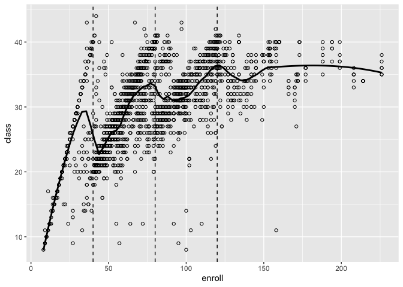

# chapter18_ファジーな回帰不連続デザイン


## 前準備

``` r
library(tidyverse)
```

    ── Attaching core tidyverse packages ──────────────────────── tidyverse 2.0.0 ──
    ✔ dplyr     1.1.4     ✔ readr     2.1.5
    ✔ forcats   1.0.0     ✔ stringr   1.5.1
    ✔ ggplot2   3.5.1     ✔ tibble    3.2.1
    ✔ lubridate 1.9.3     ✔ tidyr     1.3.1
    ✔ purrr     1.0.2     
    ── Conflicts ────────────────────────────────────────── tidyverse_conflicts() ──
    ✖ dplyr::filter() masks stats::filter()
    ✖ dplyr::lag()    masks stats::lag()
    ℹ Use the conflicted package (<http://conflicted.r-lib.org/>) to force all conflicts to become errors

``` r
DATA18 <- "https://raw.githubusercontent.com/mtakahashi123/causality/main/data18.csv"
data18 <- read_csv(DATA18)
```

    Rows: 2024 Columns: 6
    ── Column specification ────────────────────────────────────────────────────────
    Delimiter: ","
    dbl (6): school, math, class, enroll, pctdis, fsc

    ℹ Use `spec()` to retrieve the full column specification for this data.
    ℹ Specify the column types or set `show_col_types = FALSE` to quiet this message.

## 使用するデータ

``` r
data18 |>
  ggplot(aes(x = enroll, y = class)) +
  geom_point(shape = 1) +
  geom_vline(xintercept = 40, linetype = "dashed") +
  geom_vline(xintercept = 80, linetype = "dashed") +
  geom_vline(xintercept = 120, linetype = "dashed") +
  geom_smooth(method = "loess", se =FALSE, span = 0.15, color = "black")
```

    `geom_smooth()` using formula = 'y ~ x'



## R によるファジー RDD

二段階最小二乗法によるファジーRDD

``` r
data18a <- data18 |>
  mutate(
    h1 = 36 <= enroll & enroll <= 45,
    h2 = 76 <= enroll & enroll <= 85,
    h3 = 116 <= enroll & enroll <= 125,
  ) |>
  filter(h1 | h2 | h3)

first <- data18a |> lm(data = _, formula = class ~ fsc + pctdis + enroll)
data18b <- data18a |>
  mutate(
    x1hat = predict(first)
  )
second <- data18b |> lm(data = _, math ~ x1hat + pctdis + enroll)
summary(second)
```


    Call:
    lm(formula = math ~ x1hat + pctdis + enroll, data = data18b)

    Residuals:
         Min       1Q   Median       3Q      Max 
    -27.0082  -5.9623  -0.2463   6.2375  22.8556 

    Coefficients:
                Estimate Std. Error t value Pr(>|t|)    
    (Intercept) 80.54307    4.20328  19.162  < 2e-16 ***
    x1hat       -0.44345    0.17586  -2.522  0.01201 *  
    pctdis      -0.43474    0.03692 -11.775  < 2e-16 ***
    enroll       0.07940    0.02668   2.976  0.00308 ** 
    ---
    Signif. codes:  0 '***' 0.001 '**' 0.01 '*' 0.05 '.' 0.1 ' ' 1

    Residual standard error: 8.531 on 467 degrees of freedom
    Multiple R-squared:  0.3053,    Adjusted R-squared:  0.3008 
    F-statistic: 68.41 on 3 and 467 DF,  p-value: < 2.2e-16

R パッケージ `AER` によるファジーRDD

``` r
library(AER)
```

    Loading required package: car

    Loading required package: carData


    Attaching package: 'car'

    The following object is masked from 'package:dplyr':

        recode

    The following object is masked from 'package:purrr':

        some

    Loading required package: lmtest

    Loading required package: zoo


    Attaching package: 'zoo'

    The following objects are masked from 'package:base':

        as.Date, as.Date.numeric

    Loading required package: sandwich

    Loading required package: survival

``` r
# libray(ivpack)

modelIV <- data18a |>
  AER::ivreg(formula = math ~ class + pctdis + enroll | fsc + pctdis + enroll, data = _)

summary(modelIV)
```


    Call:
    AER::ivreg(formula = math ~ class + pctdis + enroll | fsc + pctdis + 
        enroll, data = data18a)

    Residuals:
         Min       1Q   Median       3Q      Max 
    -31.2565  -5.9524  -0.3264   6.6002  22.0576 

    Coefficients:
                Estimate Std. Error t value Pr(>|t|)    
    (Intercept) 80.54307    4.48416  17.962   <2e-16 ***
    class       -0.44345    0.18761  -2.364   0.0185 *  
    pctdis      -0.43474    0.03939 -11.037   <2e-16 ***
    enroll       0.07940    0.02847   2.789   0.0055 ** 
    ---
    Signif. codes:  0 '***' 0.001 '**' 0.01 '*' 0.05 '.' 0.1 ' ' 1

    Residual standard error: 9.101 on 467 degrees of freedom
    Multiple R-Squared: 0.2093, Adjusted R-squared: 0.2043 
    Wald test: 60.11 on 3 and 467 DF,  p-value: < 2.2e-16 

``` r
# ivpack が CRAN から削除されたため、クラスター頑健標準誤差を計算できない
```
