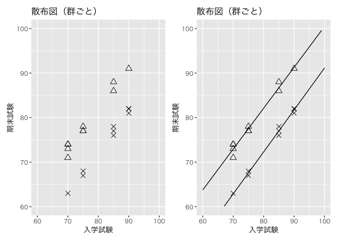

# chapter3_統計的因果推論における重要な仮定


## 前準備

``` r
library(tidyverse)
```

    ── Attaching core tidyverse packages ──────────────────────── tidyverse 2.0.0 ──
    ✔ dplyr     1.1.4     ✔ readr     2.1.5
    ✔ forcats   1.0.0     ✔ stringr   1.5.1
    ✔ ggplot2   3.5.1     ✔ tibble    3.2.1
    ✔ lubridate 1.9.3     ✔ tidyr     1.3.1
    ✔ purrr     1.0.2     
    ── Conflicts ────────────────────────────────────────── tidyverse_conflicts() ──
    ✖ dplyr::filter() masks stats::filter()
    ✖ dplyr::lag()    masks stats::lag()
    ℹ Use the conflicted package (<http://conflicted.r-lib.org/>) to force all conflicts to become errors

``` r
library(patchwork)

DATA03 <- "https://raw.githubusercontent.com/mtakahashi123/causality/main/data03.csv"
```

## SUTVA (Stable Unit Treatment Value Assumption)

因果推論を可能にするための重要な仮定。処置を受ける個体（unit）ごとに処置の値が安定的であるという仮定。

1.  相互干渉がない（no interference）
    - 個体 A に対しての処置が別の個体 B に対して影響を及ぼさない
2.  個体に対する隠れた処置がない（no hidden variations of treatments）
    - ある処置を受ける個体が、その処置を別の形で受けてはいけない

## 実験研究における平均処置効果（ATE）の推定

$\tau_{ATE} = \mathbb{E}[Y_i(1)] - \mathbb{E}[Y_i(0)]$

無作為割付けの場合、独立性の条件が満たされることから、

$\mathbb{E}[Y_i|Ti = 1] = \mathbb{E}[Y_i(1)|T_i = 1] = \mathbb{E}[Y_i(1)]$

$\mathbb{E}[Y_i|Ti = 0] = \mathbb{E}[Y_i(0)|T_i = 0] = \mathbb{E}[Y_i(0)]$

が成り立つ。したがって、

$\mathbb{E}[Y_i|T_i = 1] - \mathbb{E}[Y_i|T_i = 0] = \mathbb{E}[Y_i(1)] - \mathbb{E}[Y_i(0)]$

が成り立つ。つまり、無作為割付けの場合、観測量のみから平均処置効果（ATE）を適切に推定できる。

## 共変量の役割

``` r
df <- read_csv(DATA03)
```

    Rows: 20 Columns: 5
    ── Column specification ────────────────────────────────────────────────────────
    Delimiter: ","
    dbl (5): x1, y3, t1, y0t, y1t

    ℹ Use `spec()` to retrieve the full column specification for this data.
    ℹ Specify the column types or set `show_col_types = FALSE` to quiet this message.

``` r
df
```

    # A tibble: 20 × 5
          x1    y3    t1   y0t   y1t
       <dbl> <dbl> <dbl> <dbl> <dbl>
     1    70    74     1    62    74
     2    70    63     0    63    74
     3    70    73     1    62    73
     4    70    71     1    65    71
     5    70    74     1    63    74
     6    75    67     0    67    77
     7    75    77     1    68    77
     8    75    68     0    68    76
     9    75    77     1    68    77
    10    75    78     1    67    78
    11    85    88     1    78    88
    12    85    77     0    77    86
    13    85    76     0    76    87
    14    85    86     1    74    86
    15    85    78     0    78    85
    16    90    81     0    81    91
    17    90    91     1    81    91
    18    90    82     0    82    91
    19    90    82     0    82    92
    20    90    82     0    82    92

``` r
df |>
  group_by(x1) |>
  summarise(
    rate = mean(t1)
  )
```

    # A tibble: 4 × 2
         x1  rate
      <dbl> <dbl>
    1    70   0.8
    2    75   0.6
    3    85   0.4
    4    90   0.2

``` r
df |>
  summarize(
    naive_ATE = mean(if_else(t1 == 1, y3, NA), na.rm = TRUE) - mean(if_else(t1 == 0, y3, NA), na.rm = TRUE),
    ATE = mean(y1t) - mean(y0t),
  )
```

    # A tibble: 1 × 2
      naive_ATE   ATE
          <dbl> <dbl>
    1      3.30   9.8

## 回帰分析と共分散分析

``` r
p1 <- df |>
  ggplot(aes(x = x1, y = y3)) +
  geom_point(
    fill = NA,
    shape = 21,
    size = 3,
  ) +
  labs(
    title = "散布図（全集団）",
    x = "入学試験",
    y = "期末試験"
  ) +
  coord_cartesian(x = c(60, 100), y = c(60, 100)) +
  theme(text = element_text(family = "Hiragino Sans"))

p2 <- df |>
  ggplot(aes(x = x1, y = y3)) +
  geom_point(
    fill = NA,
    shape = 21,
    size = 3,
  ) +
  stat_smooth(
    method = "lm",
    se = FALSE,
    size = 0.5,
    color = "black",
    fullrange = TRUE,
    ) +
  labs(
    title = "回帰直線（全集団）",
    x = "入学試験",
    y = "期末試験"
  ) +
  scale_x_continuous(limits = c(60, 100)) +
  scale_y_continuous(limits = c(60, 100)) +
  coord_cartesian(x = c(60, 100), y = c(60, 100)) +
  theme(text = element_text(family = "Hiragino Sans"))
```

    Warning: Using `size` aesthetic for lines was deprecated in ggplot2 3.4.0.
    ℹ Please use `linewidth` instead.

``` r
p1 + p2
```

    `geom_smooth()` using formula = 'y ~ x'


``` r
p1 <- df |> mutate(t1 = factor(t1)) |>
  ggplot(aes(x = x1, y = y3, shape = t1)) +
  geom_point(size = 3) +
  scale_shape_manual(values = c(4, 2)) +
  labs(
    title = "散布図（群ごと）",
    x = "入学試験",
    y = "期末試験"
  ) +
  coord_cartesian(x = c(60, 100), y = c(60, 100)) +
  theme(
    text = element_text(family = "Hiragino Sans"),
    legend.position = "none"
  )

p2 <- df |> mutate(t1 = factor(t1)) |>
  ggplot(aes(x = x1, y = y3, shape = t1)) +
  geom_point(size = 3) +
  stat_smooth(
    method = "lm",
    se = FALSE,
    size = 0.5,
    color = "black",
    fullrange = TRUE,
    ) +
  scale_shape_manual(values = c(4, 2)) +
  labs(
    title = "散布図（群ごと）",
    x = "入学試験",
    y = "期末試験"
  ) +
  scale_x_continuous(limits = c(60, 100)) +
  scale_y_continuous(limits = c(60, 100)) +
  coord_cartesian(x = c(60, 100), y = c(60, 100)) +
  theme(
    text = element_text(family = "Hiragino Sans"),
    legend.position = "none"
    )

p1 + p2
```

    `geom_smooth()` using formula = 'y ~ x'

    Warning: Removed 16 rows containing missing values or values outside the scale range
    (`geom_smooth()`).



``` r
model1 <- df |>
  lm(data = _, y3 ~ x1 + t1)

print(summary(model1))
```


    Call:
    lm(formula = y3 ~ x1 + t1, data = df)

    Residuals:
         Min       1Q   Median       3Q      Max 
    -1.84950 -0.54042  0.07711  0.38619  1.18781 

    Coefficients:
                Estimate Std. Error t value Pr(>|t|)    
    (Intercept) -2.12562    2.27423  -0.935    0.363    
    x1           0.93085    0.02704  34.422  < 2e-16 ***
    t1           9.81592    0.42757  22.957 3.11e-14 ***
    ---
    Signif. codes:  0 '***' 0.001 '**' 0.01 '*' 0.05 '.' 0.1 ' ' 1

    Residual standard error: 0.8573 on 17 degrees of freedom
    Multiple R-squared:  0.9867,    Adjusted R-squared:  0.9851 
    F-statistic: 629.5 on 2 and 17 DF,  p-value: < 2.2e-16

``` r
print(confint(model1))
```

                     2.5 %     97.5 %
    (Intercept) -6.9238192  2.6725754
    x1           0.8737921  0.9878995
    t1           8.9138219 10.7180189
