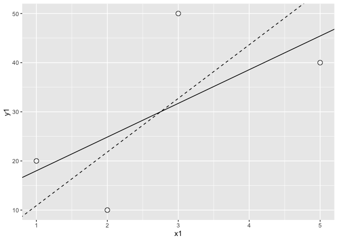
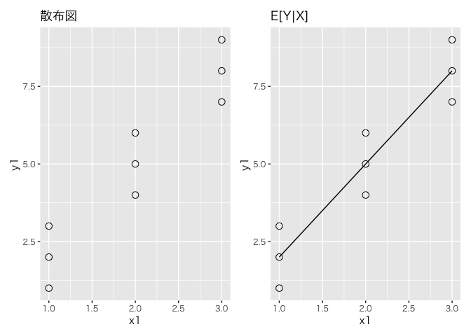
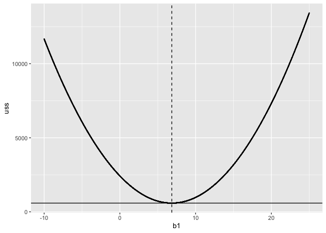

# chapter5_回帰分析の基礎


## 前準備

``` r
library(tidyverse)
```

    ── Attaching core tidyverse packages ──────────────────────── tidyverse 2.0.0 ──
    ✔ dplyr     1.1.4     ✔ readr     2.1.5
    ✔ forcats   1.0.0     ✔ stringr   1.5.1
    ✔ ggplot2   3.5.1     ✔ tibble    3.2.1
    ✔ lubridate 1.9.3     ✔ tidyr     1.3.1
    ✔ purrr     1.0.2     
    ── Conflicts ────────────────────────────────────────── tidyverse_conflicts() ──
    ✖ dplyr::filter() masks stats::filter()
    ✖ dplyr::lag()    masks stats::lag()
    ℹ Use the conflicted package (<http://conflicted.r-lib.org/>) to force all conflicts to become errors

``` r
library(patchwork)
```

## 数値例で理解する最小二乗法

``` r
data <- tribble(
  ~y1, ~x1,
  40, 5,
  20, 1,
  50, 3,
  10, 2,
)
```

``` r
data |>
  ggplot(aes(x = x1, y = y1)) +
  geom_point(size = 3, shape = 21) +
  geom_abline(slope = 6.857, intercept = 11.143) +
  geom_abline(slope = 10.909, intercept = 0000, linetype = "dashed")
```



``` r
yhat1 <- data |>
  pull(x1) |>
  map_dbl(~ 11.143 + 6.857 * .)

e1 <- data |>
  pull(y1) - yhat1

print(yhat1)
```

    [1] 45.428 18.000 31.714 24.857

``` r
print(e1)
```

    [1]  -5.428   2.000  18.286 -14.857

``` r
yhat2 <- data |>
  pull(x1) |>
  map_dbl(~ 10.909 * .)

e2 <- data |>
  pull(y1) - yhat2

print(yhat2)
```

    [1] 54.545 10.909 32.727 21.818

``` r
print(e2)
```

    [1] -14.545   9.091  17.273 -11.818

``` r
print(sum(e1))
```

    [1] 0.001

``` r
print(sum(e2))
```

    [1] 0.001

``` r
e1b <- e1^2
e2b <- e2^2
print(sum(e1b))
```

    [1] 588.5714

``` r
print(sum(e2b))
```

    [1] 732.225

## 種明かし：最小二乗法による切片と傾きの公式

$$
\hat{\beta}_0 = \bar{Y} - \hat{\beta}_1\bar{X} \\
\hat{\beta}_1 = \frac{\sum{(X_i - \bar{X})(Y_i - \bar{Y})}}{\sum{(X_i - \bar{X})^2}}
$$

``` r
xbar <- data |> pull(x1) |> mean()
ybar <- data |> pull(y1) |> mean()

print(xbar)
```

    [1] 2.75

``` r
print(ybar)
```

    [1] 30

``` r
hensax <- data |> pull(x1) |> map_dbl(~ . - xbar)
hensay <- data |> pull(y1) |> map_dbl(~ . - ybar)

print(hensax)
```

    [1]  2.25 -1.75  0.25 -0.75

``` r
print(hensay)
```

    [1]  10 -10  20 -20

``` r
hensaxy <- hensax * hensay
numerator <- sum(hensaxy)

print(numerator)
```

    [1] 60

``` r
hensax2 <- hensax^2
denominator <- sum(hensax2)

print(denominator)
```

    [1] 8.75

``` r
b1 <- numerator / denominator
b0 <- ybar - b1 * xbar

print(b1)
```

    [1] 6.857143

``` r
print(b0)
```

    [1] 11.14286

``` r
model1 <- data |> lm(data = _, y1 ~ x1)
summary(model1)
```


    Call:
    lm(formula = y1 ~ x1, data = data)

    Residuals:
          1       2       3       4 
     -5.429   2.000  18.286 -14.857 

    Coefficients:
                Estimate Std. Error t value Pr(>|t|)
    (Intercept)   11.143     18.109   0.615    0.601
    x1             6.857      5.799   1.182    0.359

    Residual standard error: 17.15 on 2 degrees of freedom
    Multiple R-squared:  0.4114,    Adjusted R-squared:  0.1171 
    F-statistic: 1.398 on 1 and 2 DF,  p-value: 0.3586

## 条件付き期待値としての回帰モデル

``` r
data <- tribble(
  ~y1, ~x1,
  1, 1,
  2, 1,
  3, 1,
  4, 2,
  5, 2,
  6, 2,
  7, 3,
  8, 3,
  9, 3,
)

print(data |> pull(y1) |> mean())
```

    [1] 5

``` r
model2 <- data |>
  lm(data = _, y1 ~ x1)

summary(model2)
```


    Call:
    lm(formula = y1 ~ x1, data = data)

    Residuals:
       Min     1Q Median     3Q    Max 
        -1     -1      0      1      1 

    Coefficients:
                Estimate Std. Error t value Pr(>|t|)    
    (Intercept)  -1.0000     0.8165  -1.225     0.26    
    x1            3.0000     0.3780   7.937 9.58e-05 ***
    ---
    Signif. codes:  0 '***' 0.001 '**' 0.01 '*' 0.05 '.' 0.1 ' ' 1

    Residual standard error: 0.9258 on 7 degrees of freedom
    Multiple R-squared:    0.9, Adjusted R-squared:  0.8857 
    F-statistic:    63 on 1 and 7 DF,  p-value: 9.585e-05

``` r
p1 <- data |>
  ggplot(aes(x = x1, y = y1)) +
  geom_point(size = 3, shape = 21) +
  labs(
    title = "散布図"
  ) +
  theme(
    text = element_text(family = "Hiragino Sans")
  )

p2 <- data |>
  ggplot(aes(x = x1, y = y1)) +
  geom_point(size = 3, shape = 21) +
  geom_smooth(method = "lm", se = FALSE, color = "black", size = 0.5) +
  labs(
    title = "E[Y|X]"
  ) +
  theme(
    text = element_text(family = "Hiragino Sans")
  )
```

    Warning: Using `size` aesthetic for lines was deprecated in ggplot2 3.4.0.
    ℹ Please use `linewidth` instead.

``` r
p1 + p2
```

    `geom_smooth()` using formula = 'y ~ x'



## 最小二乗法による切片と傾きの公式（補遺）

``` r
data <- tribble(
  ~x1, ~y1,
  5, 40,
  1, 20,
  3, 50,
  2, 10,
)
data
```

    # A tibble: 4 × 2
         x1    y1
      <dbl> <dbl>
    1     5    40
    2     1    20
    3     3    50
    4     2    10

``` r
model3 <- data |>
  lm(data = _, y1 ~ x1)

bOLS <- summary(model3)$coefficient[2, 1]
ussOLS <- sum((resid(model3))^2)
```

``` r
b1 <- NULL
uss <- NULL
set.seed(1)
for(i in 1:10000) {
  a1 <- 11.14286
  b1[i] <- runif(1, -10, 25)
  yhat <- a1 + b1[i] * data$x1
  uss[i] <- sum((data$y1 -yhat)^2)
}

print(summary(uss))
```

       Min. 1st Qu.  Median    Mean 3rd Qu.    Max. 
      588.6  1335.9  3625.2  4651.5  7484.7 13422.5 

``` r
print(ussOLS)
```

    [1] 588.5714

``` r
result_df <- tibble(b1 = b1, uss = uss)

ggplot(data = result_df, aes(x = b1, y = uss)) +
  geom_point(size = 0.1) +
  geom_vline(xintercept = bOLS, linetype = "dashed") +
  geom_hline(yintercept = ussOLS)
```


