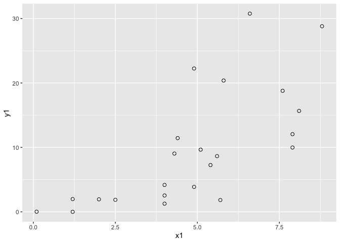

# chapter6_図で理解する重回帰モデルの基礎


## 前準備

``` r
library(tidyverse)
```

    ── Attaching core tidyverse packages ──────────────────────── tidyverse 2.0.0 ──
    ✔ dplyr     1.1.4     ✔ readr     2.1.5
    ✔ forcats   1.0.0     ✔ stringr   1.5.1
    ✔ ggplot2   3.5.1     ✔ tibble    3.2.1
    ✔ lubridate 1.9.3     ✔ tidyr     1.3.1
    ✔ purrr     1.0.2     
    ── Conflicts ────────────────────────────────────────── tidyverse_conflicts() ──
    ✖ dplyr::filter() masks stats::filter()
    ✖ dplyr::lag()    masks stats::lag()
    ℹ Use the conflicted package (<http://conflicted.r-lib.org/>) to force all conflicts to become errors

``` r
DATA06 <- "https://raw.githubusercontent.com/mtakahashi123/causality/main/data06.csv"

data06 <- read_csv(DATA06)
```

    Rows: 23 Columns: 4
    ── Column specification ────────────────────────────────────────────────────────
    Delimiter: ","
    chr (1): country
    dbl (3): y1, x1, x2

    ℹ Use `spec()` to retrieve the full column specification for this data.
    ℹ Specify the column types or set `show_col_types = FALSE` to quiet this message.

## 分散

変数 $Y$ の不偏分散

$$
\mathrm{var}[Y] = \frac{1}{n - 1} \sum_{i=1}^n {\left(Y_i - \bar{Y}\right)^2}
$$

``` r
hensa <- data06$y1 - mean(data06$y1)
hensa2 <- hensa^2
tss <- sum(hensa2)

print(tss)
```

    [1] 1831.718

``` r
print(tss / (NROW(data06) - 1))
```

    [1] 83.25992

``` r
print(var(data06$y1))
```

    [1] 83.25992

## ESS と USS

``` r
model1 <- data06 |> lm(data = _, y1 ~ x1)
summary(model1)
```


    Call:
    lm(formula = y1 ~ x1, data = data06)

    Residuals:
         Min       1Q   Median       3Q      Max 
    -10.1603  -4.3915  -0.7202   2.5621  16.3355 

    Coefficients:
                Estimate Std. Error t value Pr(>|t|)    
    (Intercept)  -3.4217     3.2274  -1.060 0.301096    
    x1            2.7044     0.5985   4.519 0.000188 ***
    ---
    Signif. codes:  0 '***' 0.001 '**' 0.01 '*' 0.05 '.' 0.1 ' ' 1

    Residual standard error: 6.65 on 21 degrees of freedom
    Multiple R-squared:  0.493, Adjusted R-squared:  0.4689 
    F-statistic: 20.42 on 1 and 21 DF,  p-value: 0.000188

``` r
confint(model1, level = 0.95)
```

                     2.5 %   97.5 %
    (Intercept) -10.133320 3.290018
    x1            1.459837 3.949020

``` r
data06 |>
  ggplot(aes(x = x1, y = y1)) +
  geom_point(shape = 21, size = 2)
```



ESS (Explained Sum of Squares)

$$
ESS = \sum_{i=1}^{n} {\left(\hat{Y_i} - \bar{Y}\right)^2}
$$

``` r
yhat1 <- -3.4217 + 2.7044 * data06$x1
yhat2 <- (yhat1 - mean(data06$y1))^2
ess <- sum(yhat2)

print(yhat1)
```

     [1]  9.82986 18.48394 11.72294 -0.17642  7.39590 -3.15126  9.82986 11.18206
     [9]  8.20722 17.94306  3.33930 17.94306  7.39590 -0.17642 10.37074 12.26382
    [17] 11.99338  1.98710  7.39590 14.42734 20.37702 17.13174  8.47766

``` r
print(yhat2)
```

     [1] 6.743793e-03 7.632120e+01 3.901417e+00 9.848894e+01 5.531149e+00
     [6] 1.663842e+02 6.743793e-03 2.057276e+00 2.373200e+00 6.716328e+01
    [11] 4.106810e+01 6.716328e+01 5.531149e+00 9.848894e+01 3.881297e-01
    [16] 6.330662e+00 5.042902e+00 6.022752e+01 5.531149e+00 2.189866e+01
    [21] 1.129816e+02 5.452346e+01 1.613102e+00

``` r
print(ess)
```

    [1] 903.0228

``` r
print(predict(model1))
```

             1          2          3          4          5          6          7 
     9.8300481 18.4842188 11.7231479 -0.1763368  7.3960626 -3.1512080  9.8300481 
             8          9         10         11         12         13         14 
    11.1822623  8.2073911 17.9433331  3.3394200 17.9433331  7.3960626 -0.1763368 
            15         16         17         18         19         20         21 
    10.3709338 12.2640336 11.9935908  1.9872059  7.3960626 14.4275763 20.3773187 
            22         23 
    17.1320046  8.4778339 

USS (Unexplained Sum of Squares)

$$
USS = \sum_{i=1}^{n} {\left(Y_i - \hat{Y_i}\right)^2} = \sum_{i=1}^{n} {e_{i}^2}
$$

``` r
e1 <- data06$y1 - yhat1
e2 <- e1^2
uss <- sum(e2)

print(e1)
```

     [1]  -5.95853450  -2.82540172  -3.07936723   0.17642000  -3.22203374
     [6]   3.17250979  12.41766355  -3.92178344   0.83960101  -7.96170361
    [11]  -1.47337858  -5.88857372  -4.86079432   2.15698561  -0.71997342
    [16]   8.11106303 -10.16005540  -0.04502284  -6.12992292  16.33576773
    [21]   8.42187044   1.65145650   2.96751395

``` r
print(e2)
```

     [1] 3.550413e+01 7.982895e+00 9.482503e+00 3.112402e-02 1.038150e+01
     [6] 1.006482e+01 1.541984e+02 1.538039e+01 7.049298e-01 6.338872e+01
    [11] 2.170844e+00 3.467530e+01 2.362732e+01 4.652587e+00 5.183617e-01
    [16] 6.578934e+01 1.032267e+02 2.027056e-03 3.757596e+01 2.668573e+02
    [21] 7.092790e+01 2.727309e+00 8.806139e+00

``` r
print(uss)
```

    [1] 928.6765

``` r
print(resid(model1))
```

               1            2            3            4            5            6 
     -5.95872259  -2.82568053  -3.07957516   0.17633681  -3.22219631   3.17245778 
               7            8            9           10           11           12 
     12.41747546  -3.92198570   0.83942993  -7.96197675  -1.47349863  -5.88884686 
              13           14           15           16           17           18 
     -4.86095689   2.15690242  -0.72016718   8.11084943 -10.16026616  -0.04512871 
              19           20           21           22           23 
     -6.13008549  16.33553145   8.42157179   1.65119187   2.96734004 

## 決定係数

$$
R^2 = 1 - \frac{\sum{\left(Y_i - \hat{Y}\right)^2}}{\sum{\left(Y_i - \bar{Y}\right)^2}} = 1 - \frac{USS}{TSS}
$$

``` r
print(1 - uss / tss)
```

    [1] 0.4930025

``` r
print(summary(model1)$r.squared)
```

    [1] 0.4930025

## 回帰係数の標準誤差と回帰の標準誤差

回帰係数 $\hat{\beta_1}$ の標準偏差

$$
s.e.\left(\hat{\beta_1}\right) = \frac{s_{reg}}{\sqrt{\sum\left(X_i - \bar{X}\right)^2}}
$$

回帰の標準誤差（standard error of the regression）

$$
s_{reg} = \sqrt{\frac{\sum\left(Y_i - \hat{Y_i}\right)^2}{n-k}} = \sqrt{\frac{USS}{n-k}}
$$

## 三変数の重回帰モデル

二段階の推定モデル

``` r
model1 <- lm(data06$x1 ~ data06$x2)
ex1 <- resid(model1)
model2 <- lm(data06$y1 ~ ex1)

summary(model2)
```


    Call:
    lm(formula = data06$y1 ~ ex1)

    Residuals:
        Min      1Q  Median      3Q     Max 
    -12.569  -6.312  -2.791   3.339  19.374 

    Coefficients:
                Estimate Std. Error t value Pr(>|t|)    
    (Intercept)    9.748      1.868   5.217  3.6e-05 ***
    ex1            1.505      1.117   1.347    0.192    
    ---
    Signif. codes:  0 '***' 0.001 '**' 0.01 '*' 0.05 '.' 0.1 ' ' 1

    Residual standard error: 8.96 on 21 degrees of freedom
    Multiple R-squared:  0.0795,    Adjusted R-squared:  0.03567 
    F-statistic: 1.814 on 1 and 21 DF,  p-value: 0.1924

重回帰モデル

``` r
model3 <- lm(data06$y1 ~ data06$x1 + data06$x2)
print(summary(model3))
```


    Call:
    lm(formula = data06$y1 ~ data06$x1 + data06$x2)

    Residuals:
       Min     1Q Median     3Q    Max 
    -9.474 -3.848 -1.338  3.055 16.810 

    Coefficients:
                Estimate Std. Error t value Pr(>|t|)  
    (Intercept) -6.32035    3.20331  -1.973   0.0625 .
    data06$x1    1.50477    0.75619   1.990   0.0604 .
    data06$x2    0.19552    0.08531   2.292   0.0329 *
    ---
    Signif. codes:  0 '***' 0.001 '**' 0.01 '*' 0.05 '.' 0.1 ' ' 1

    Residual standard error: 6.064 on 20 degrees of freedom
    Multiple R-squared:  0.5985,    Adjusted R-squared:  0.5583 
    F-statistic:  14.9 on 2 and 20 DF,  p-value: 0.0001089

``` r
print(confint(model3, level = 0.95))
```

                       2.5 %    97.5 %
    (Intercept) -13.00233992 0.3616436
    data06$x1    -0.07260349 3.0821496
    data06$x2     0.01757188 0.3734626

## 共分散分析（再考）

``` r
DATA03 <- "https://raw.githubusercontent.com/mtakahashi123/causality/main/data03.csv"
data03 <- read_csv(DATA03)
```

    Rows: 20 Columns: 5
    ── Column specification ────────────────────────────────────────────────────────
    Delimiter: ","
    dbl (5): x1, y3, t1, y0t, y1t

    ℹ Use `spec()` to retrieve the full column specification for this data.
    ℹ Specify the column types or set `show_col_types = FALSE` to quiet this message.

``` r
model1 <- lm(data = data03, t1 ~ x1)
et1 <- resid(model1)
model2 <- lm(y3 ~ et1, data = data03)
summary(model2)
```


    Call:
    lm(formula = y3 ~ et1, data = data03)

    Residuals:
       Min     1Q Median     3Q    Max 
    -8.409 -4.328 -0.250  4.828  6.910 

    Coefficients:
                Estimate Std. Error t value Pr(>|t|)    
    (Intercept)   77.250      1.236  62.475  < 2e-16 ***
    et1            9.816      2.758   3.559  0.00224 ** 
    ---
    Signif. codes:  0 '***' 0.001 '**' 0.01 '*' 0.05 '.' 0.1 ' ' 1

    Residual standard error: 5.53 on 18 degrees of freedom
    Multiple R-squared:  0.413, Adjusted R-squared:  0.3804 
    F-statistic: 12.67 on 1 and 18 DF,  p-value: 0.002242
