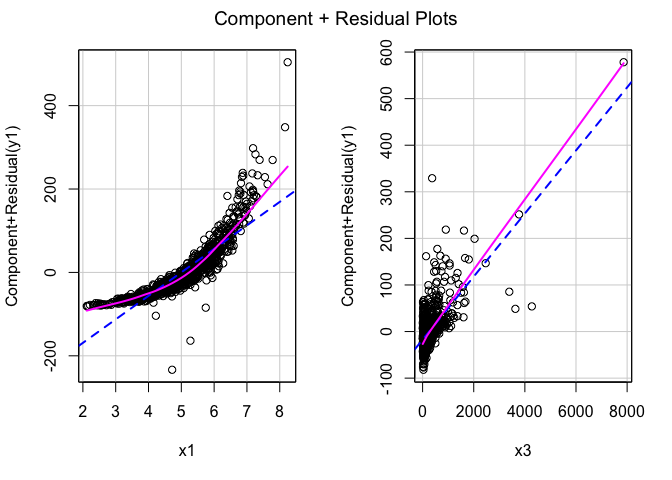
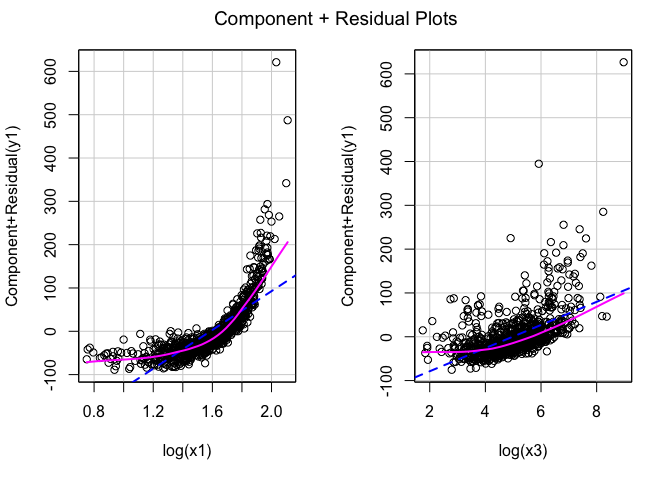
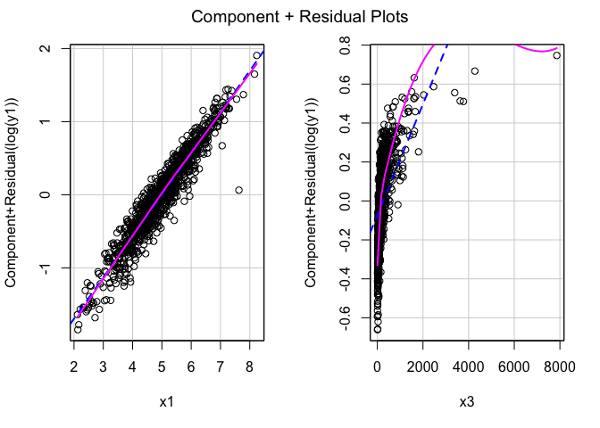
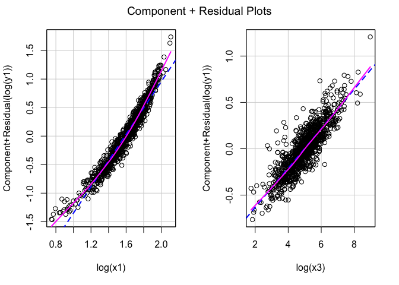
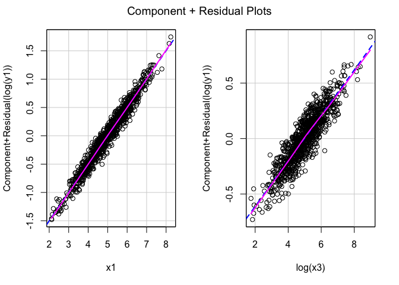
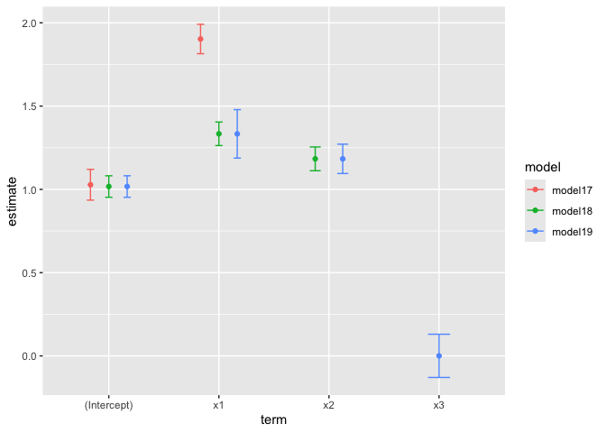

# chapter7_最小二乗法による重回帰モデルの仮定と診断１


## 前準備

``` r
library(tidyverse)
```

    ── Attaching core tidyverse packages ──────────────────────── tidyverse 2.0.0 ──
    ✔ dplyr     1.1.4     ✔ readr     2.1.5
    ✔ forcats   1.0.0     ✔ stringr   1.5.1
    ✔ ggplot2   3.5.1     ✔ tibble    3.2.1
    ✔ lubridate 1.9.3     ✔ tidyr     1.3.1
    ✔ purrr     1.0.2     
    ── Conflicts ────────────────────────────────────────── tidyverse_conflicts() ──
    ✖ dplyr::filter() masks stats::filter()
    ✖ dplyr::lag()    masks stats::lag()
    ℹ Use the conflicted package (<http://conflicted.r-lib.org/>) to force all conflicts to become errors

``` r
library(stargazer)
```


    Please cite as: 

     Hlavac, Marek (2022). stargazer: Well-Formatted Regression and Summary Statistics Tables.
     R package version 5.2.3. https://CRAN.R-project.org/package=stargazer 

``` r
library(car)
```

    Loading required package: carData

    Attaching package: 'car'

    The following object is masked from 'package:dplyr':

        recode

    The following object is masked from 'package:purrr':

        some

``` r
DATA07A <- "https://raw.githubusercontent.com/mtakahashi123/causality/main/data07a.csv"
DATA07B <- "https://raw.githubusercontent.com/mtakahashi123/causality/main/data07b.csv"
DATA07C <- "https://raw.githubusercontent.com/mtakahashi123/causality/main/data07c.csv"
DATA07D <- "https://raw.githubusercontent.com/mtakahashi123/causality/main/data07d.csv"

data07a <- read_csv(DATA07A)
```

    Rows: 1000 Columns: 6
    ── Column specification ────────────────────────────────────────────────────────
    Delimiter: ","
    dbl (6): y1, y2, y3, y4, x1, x2

    ℹ Use `spec()` to retrieve the full column specification for this data.
    ℹ Specify the column types or set `show_col_types = FALSE` to quiet this message.

``` r
data07b <- read_csv(DATA07B)
```

    Rows: 1000 Columns: 3
    ── Column specification ────────────────────────────────────────────────────────
    Delimiter: ","
    dbl (3): y1, x1, x3

    ℹ Use `spec()` to retrieve the full column specification for this data.
    ℹ Specify the column types or set `show_col_types = FALSE` to quiet this message.

``` r
data07c <- read_csv(DATA07C)
```

    Rows: 1000 Columns: 4
    ── Column specification ────────────────────────────────────────────────────────
    Delimiter: ","
    dbl (4): y1, x1, x2, x3

    ℹ Use `spec()` to retrieve the full column specification for this data.
    ℹ Specify the column types or set `show_col_types = FALSE` to quiet this message.

``` r
data07d <- read_csv(DATA07D)
```

    Rows: 1000 Columns: 3
    ── Column specification ────────────────────────────────────────────────────────
    Delimiter: ","
    dbl (3): y1, x1, x2

    ℹ Use `spec()` to retrieve the full column specification for this data.
    ℹ Specify the column types or set `show_col_types = FALSE` to quiet this message.

## 仮定１：誤差項の期待値ゼロ

``` r
set.seed(1)
n1 <- 1000
a0 <- 1
b1 <- 1.5
x1 <- rnorm(n = n1)
u1 <- rnorm(n = n1, mean = 10, sd = 1)
y1 <- a0 + b1 * x1 + u1
model1 <- lm(y1 ~ x1)
summary(model1) # 切片は正しく推定できていないが、傾きは正しく推定できている
```


    Call:
    lm(formula = y1 ~ x1)

    Residuals:
        Min      1Q  Median      3Q     Max 
    -3.2484 -0.6720 -0.0138  0.7554  3.6443 

    Coefficients:
                Estimate Std. Error t value Pr(>|t|)    
    (Intercept) 10.98381    0.03290  333.80   <2e-16 ***
    x1           1.50643    0.03181   47.36   <2e-16 ***
    ---
    Signif. codes:  0 '***' 0.001 '**' 0.01 '*' 0.05 '.' 0.1 ' ' 1

    Residual standard error: 1.04 on 998 degrees of freedom
    Multiple R-squared:  0.6921,    Adjusted R-squared:  0.6918 
    F-statistic:  2243 on 1 and 998 DF,  p-value: < 2.2e-16

## 仮定２：パラメータ（母数）における線形性

$\beta_0 = 1.0$, $\beta_1 = 1.5$, $\varepsilon_i \sim \mathcal{N}(0, 1)$
, $X_{1i} \sim \mathcal{N}(0, 1)$, $X_{2i} \sim \mathcal{LN}(0, 1)$
とする。

$$
\begin{aligned}
Y_{1i} &= \beta_0 + \beta_1 X_{1i} + \varepsilon_i \\
Y_{2i} &= \beta_0 + \beta_1 \log{X_{2i}} + \varepsilon_i \\
Y_{3i} &= \exp\left( \beta_0 + \beta_1 X_{1i} + \varepsilon_i \right) \\
Y_{4i} &= \beta_0 X_{2i}^{\beta_1} e^{\varepsilon_i}
\end{aligned}
$$

### 線形モデルによる推定

``` r
model1 <- lm(y1 ~ x1, data = data07a)
model2 <- lm(y2 ~ x2, data = data07a)
model3 <- lm(y3 ~ x1, data = data07a)
model4 <- lm(y4 ~ x2, data = data07a)

# モデル2 ~ 4 は beta_1 をうまく推定できていない
stargazer::stargazer(
  model1, model2, model3, model4,
  type = "text"
)
```


    ===========================================================================
                                               Dependent variable:             
                                   --------------------------------------------
                                        y1          y2        y3         y4    
                                       (1)         (2)        (3)       (4)    
    ---------------------------------------------------------------------------
    x1                               1.506***              36.446***           
                                     (0.031)                (4.140)            
                                                                               
    x2                                           0.661***             5.234*** 
                                                 (0.022)              (0.247)  
                                                                               
    Constant                         0.988***    -0.105*   20.277*** -3.352*** 
                                     (0.033)     (0.058)    (4.304)   (0.641)  
                                                                               
    ---------------------------------------------------------------------------
    Observations                      1,000       1,000      1,000     1,000   
    R2                                0.696       0.472      0.072     0.311   
    Adjusted R2                       0.696       0.471      0.071     0.310   
    Residual Std. Error (df = 998)    1.035       1.384     136.076    15.417  
    F Statistic (df = 1; 998)      2,286.930*** 890.952*** 77.509*** 450.374***
    ===========================================================================
    Note:                                           *p<0.1; **p<0.05; ***p<0.01

### 変数変換

``` r
model5 <- lm(y2 ~ log(x2), data = data07a)
model6 <- lm(log(y3) ~ x1, data = data07a)
model7 <- lm(log(y4) ~ log(x2), data = data07a)

stargazer::stargazer(
  model5, model6, model7,
  type = "text"
)
```


    =====================================================================
                                            Dependent variable:          
                                   --------------------------------------
                                        y2        log(y3)      log(y4)   
                                       (1)          (2)          (3)     
    ---------------------------------------------------------------------
    log(x2)                          1.550***                  1.550***  
                                     (0.032)                   (0.032)   
                                                                         
    x1                                            1.506***               
                                                  (0.031)                
                                                                         
    Constant                         0.988***     0.988***      -0.012   
                                     (0.033)      (0.033)      (0.033)   
                                                                         
    ---------------------------------------------------------------------
    Observations                      1,000        1,000        1,000    
    R2                                0.705        0.696        0.705    
    Adjusted R2                       0.705        0.696        0.705    
    Residual Std. Error (df = 998)    1.034        1.035        1.034    
    F Statistic (df = 1; 998)      2,384.523*** 2,286.930*** 2,384.523***
    =====================================================================
    Note:                                     *p<0.1; **p<0.05; ***p<0.01

### 変数の線形性と母数の線形性の違い

``` r
set.seed(1)
n1 <- 1000

b0 <- 1
b1 <- 0.6
b2 <- 0.4
x3 <- runif(n = n1)
x4 <- runif(n = n1)
e1 <- rnorm(n = n1)

y5 <- b0 * x3^b1 * x4^b2 * exp(e1)
y6 <- b0 * x3^b1 * x4^b2 + e1

model8 <- lm(y5 ~ x3 + x4)
model9 <- lm(log(y5) ~ log(x3) + log(x4))
model10 <- lm(y6 ~ x3 + x4)
model11 <- lm(log(y6) ~ log(x3) + log(x4))
```

    Warning in log(y6): NaNs produced

``` r
stargazer::stargazer(
  model8, model9, model10, model11,
  type = "text"
)
```


    ===================================================================================================================
                                                              Dependent variable:                                      
                        -----------------------------------------------------------------------------------------------
                                  y5                    log(y5)                    y6                   log(y6)        
                                  (1)                     (2)                      (3)                    (4)          
    -------------------------------------------------------------------------------------------------------------------
    x3                         0.981***                                         0.502***                               
                                (0.124)                                          (0.115)                               
                                                                                                                       
    x4                         0.907***                                         0.625***                               
                                (0.120)                                          (0.112)                               
                                                                                                                       
    log(x3)                                             0.600***                                         0.063         
                                                        (0.034)                                         (0.043)        
                                                                                                                       
    log(x4)                                             0.451***                                        0.110***       
                                                        (0.031)                                         (0.040)        
                                                                                                                       
    Constant                   -0.187**                  0.037                   -0.135                 -0.160**       
                                (0.094)                 (0.058)                  (0.087)                (0.066)        
                                                                                                                       
    -------------------------------------------------------------------------------------------------------------------
    Observations                 1,000                   1,000                    1,000                   655          
    R2                           0.105                   0.332                    0.047                  0.014         
    Adjusted R2                  0.103                   0.331                    0.045                  0.011         
    Residual Std. Error    1.126 (df = 997)         1.040 (df = 997)        1.045 (df = 997)        0.972 (df = 652)   
    F Statistic         58.257*** (df = 2; 997) 247.589*** (df = 2; 997) 24.546*** (df = 2; 997) 4.781*** (df = 2; 652)
    ===================================================================================================================
    Note:                                                                                   *p<0.1; **p<0.05; ***p<0.01

### 多変量における診断方法

``` r
model12 <- lm(y1 ~ x1 + x3, data = data07b)
model13 <- lm(y1 ~ log(x1) + log(x3), data = data07b)
model14 <- lm(log(y1) ~ x1 + x3, data = data07b)
model15 <- lm(log(y1) ~ log(x1) + log(x3), data = data07b)
```

``` r
car::crPlots(model12)
```



``` r
car::crPlots(model13)
```



``` r
car::crPlots(model14)
```



``` r
car::crPlots(model15)
```



``` r
model16 <- lm(log(y1) ~ x1 + log(x3), data = data07b)
car::crPlots(model16)
```



``` r
summary(model16)
```


    Call:
    lm(formula = log(y1) ~ x1 + log(x3), data = data07b)

    Residuals:
         Min       1Q   Median       3Q      Max 
    -0.36151 -0.06564 -0.00223  0.06815  0.28132 

    Coefficients:
                Estimate Std. Error t value Pr(>|t|)    
    (Intercept) 0.973305   0.018445   52.77   <2e-16 ***
    x1          0.500630   0.003635  137.72   <2e-16 ***
    log(x3)     0.205034   0.003615   56.72   <2e-16 ***
    ---
    Signif. codes:  0 '***' 0.001 '**' 0.01 '*' 0.05 '.' 0.1 ' ' 1

    Residual standard error: 0.1031 on 997 degrees of freedom
    Multiple R-squared:  0.9755,    Adjusted R-squared:  0.9755 
    F-statistic: 1.986e+04 on 2 and 997 DF,  p-value: < 2.2e-16

## 仮定３：誤差項の条件付き期待値ゼロ

### 不要な変数をモデルに取り入れる問題

$$
Y_i = \beta_0 + \beta_1 X_{1i} + \beta_2 X_{2i} + \beta_3 X_{3i} + \varepsilon_i \\
\beta_0 = 1.0, \quad \beta_1 = 1.3, \quad \beta_2 = 1.2, \quad \beta_3 = 0.0, \quad \varepsilon_i \sim \mathcal{N}(0, 1)
$$

``` r
model17 <- lm(y1 ~ x1, data = data07c)
model18 <- lm(y1 ~ x1 + x2, data = data07c)
model19 <- lm(y1 ~ x1 + x2 + x3, data = data07c)

stargazer::stargazer(
  model17, model18, model19,
  type = "text"
)
```


    ====================================================================================================
                                                      Dependent variable:                               
                        --------------------------------------------------------------------------------
                                                               y1                                       
                                   (1)                        (2)                        (3)            
    ----------------------------------------------------------------------------------------------------
    x1                           1.903***                   1.334***                   1.333***         
                                 (0.045)                    (0.036)                    (0.074)          
                                                                                                        
    x2                                                      1.183***                   1.183***         
                                                            (0.036)                    (0.045)          
                                                                                                        
    x3                                                                                  0.0003          
                                                                                       (0.066)          
                                                                                                        
    Constant                     1.028***                   1.017***                   1.017***         
                                 (0.047)                    (0.033)                    (0.033)          
                                                                                                        
    ----------------------------------------------------------------------------------------------------
    Observations                  1,000                      1,000                      1,000           
    R2                            0.641                      0.826                      0.826           
    Adjusted R2                   0.641                      0.825                      0.825           
    Residual Std. Error      1.491 (df = 998)           1.039 (df = 997)           1.040 (df = 996)     
    F Statistic         1,783.143*** (df = 1; 998) 2,362.168*** (df = 2; 997) 1,573.199*** (df = 3; 996)
    ====================================================================================================
    Note:                                                                    *p<0.1; **p<0.05; ***p<0.01

``` r
library(broom)

tidy_model17 <- broom::tidy(model17, conf.int = TRUE) |> mutate(model = "model17")
tidy_model18 <- broom::tidy(model18, conf.int = TRUE) |> mutate(model = "model18")
tidy_model19 <- broom::tidy(model19, conf.int = TRUE) |> mutate(model = "model19")
tidy_models <- bind_rows(tidy_model17, tidy_model18, tidy_model19)

tidy_models
```

    # A tibble: 9 × 8
      term        estimate std.error statistic   p.value conf.low conf.high model  
      <chr>          <dbl>     <dbl>     <dbl>     <dbl>    <dbl>     <dbl> <chr>  
    1 (Intercept) 1.03        0.0471  21.8     1.69e- 86    0.935     1.12  model17
    2 x1          1.90        0.0451  42.2     2.50e-224    1.81      1.99  model17
    3 (Intercept) 1.02        0.0329  30.9     6.41e-148    0.953     1.08  model18
    4 x1          1.33        0.0360  37.1     9.11e-190    1.26      1.40  model18
    5 x2          1.18        0.0364  32.5     1.45e-158    1.11      1.25  model18
    6 (Intercept) 1.02        0.0329  30.9     1.00e-147    0.953     1.08  model19
    7 x1          1.33        0.0741  18.0     7.59e- 63    1.19      1.48  model19
    8 x2          1.18        0.0449  26.4     1.54e-116    1.10      1.27  model19
    9 x3          0.000314    0.0661   0.00476 9.96e-  1   -0.129     0.130 model19

``` r
tidy_models |>
  ggplot(aes(x = term, y = estimate, color = model)) +
  geom_point(position = position_dodge(width = 0.5)) +
  geom_errorbar(
    aes(ymin = conf.low, ymax = conf.high),
    width = 0.2,
    position = position_dodge(width = 0.5)
  )
```



### 中間変数をモデルに取り入れる問題

``` r
model20 <- lm(y1 ~ x1, data = data07d)
model21 <- lm(y1 ~ x1 + x2, data = data07d)

stargazer::stargazer(
  model20, model21,
  type = "text"
)
```


    =========================================================================
                                         Dependent variable:                 
                        -----------------------------------------------------
                                                 y1                          
                                   (1)                        (2)            
    -------------------------------------------------------------------------
    x1                           3.157***                   1.316***         
                                 (0.050)                    (0.057)          
                                                                             
    x2                                                      1.222***         
                                                            (0.031)          
                                                                             
    Constant                     2.196***                   0.994***         
                                 (0.052)                    (0.045)          
                                                                             
    -------------------------------------------------------------------------
    Observations                  1,000                      1,000           
    R2                            0.800                      0.921           
    Adjusted R2                   0.799                      0.920           
    Residual Std. Error      1.636 (df = 998)           1.031 (df = 997)     
    F Statistic         3,982.182*** (df = 1; 998) 5,779.059*** (df = 2; 997)
    =========================================================================
    Note:                                         *p<0.1; **p<0.05; ***p<0.01
