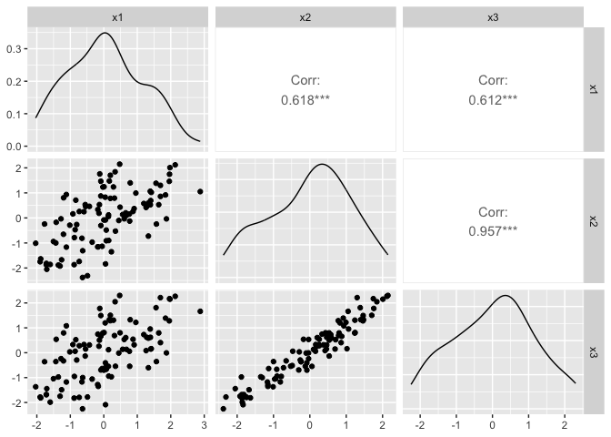
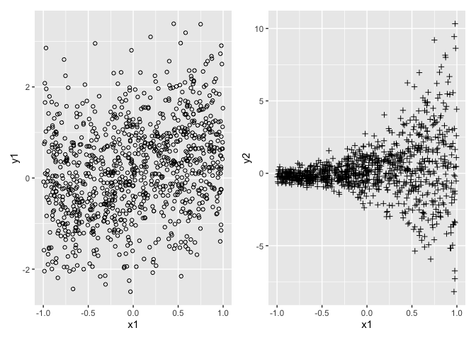
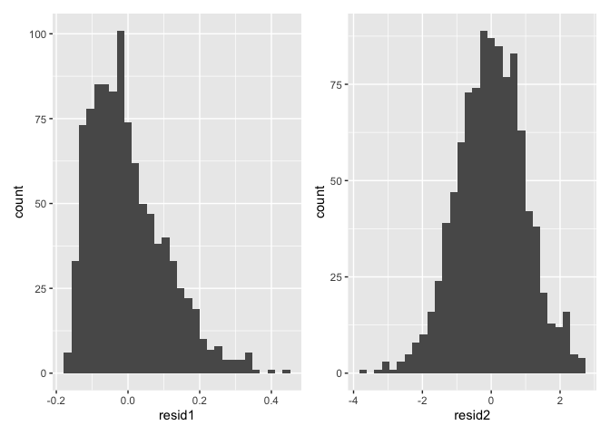

# chapter8_最小二乗法による重回帰モデルの仮定と診断２


## 前準備

``` r
library(tidyverse)
```

    ── Attaching core tidyverse packages ──────────────────────── tidyverse 2.0.0 ──
    ✔ dplyr     1.1.4     ✔ readr     2.1.5
    ✔ forcats   1.0.0     ✔ stringr   1.5.1
    ✔ ggplot2   3.5.1     ✔ tibble    3.2.1
    ✔ lubridate 1.9.3     ✔ tidyr     1.3.1
    ✔ purrr     1.0.2     
    ── Conflicts ────────────────────────────────────────── tidyverse_conflicts() ──
    ✖ dplyr::filter() masks stats::filter()
    ✖ dplyr::lag()    masks stats::lag()
    ℹ Use the conflicted package (<http://conflicted.r-lib.org/>) to force all conflicts to become errors

``` r
library(patchwork)
library(GGally)
```

    Registered S3 method overwritten by 'GGally':
      method from   
      +.gg   ggplot2

``` r
library(stargazer)
```


    Please cite as: 

     Hlavac, Marek (2022). stargazer: Well-Formatted Regression and Summary Statistics Tables.
     R package version 5.2.3. https://CRAN.R-project.org/package=stargazer 

``` r
library(car)
```

    Loading required package: carData

    Attaching package: 'car'

    The following object is masked from 'package:dplyr':

        recode

    The following object is masked from 'package:purrr':

        some

``` r
DATA08A <- "https://raw.githubusercontent.com/mtakahashi123/causality/main/data08a.csv"
DATA08B <- "https://raw.githubusercontent.com/mtakahashi123/causality/main/data08b.csv"
DATA08C <- "https://raw.githubusercontent.com/mtakahashi123/causality/main/data08c.csv"

data08a <- read_csv(DATA08A)
```

    Rows: 100 Columns: 4
    ── Column specification ────────────────────────────────────────────────────────
    Delimiter: ","
    dbl (4): y1, x1, x2, x3

    ℹ Use `spec()` to retrieve the full column specification for this data.
    ℹ Specify the column types or set `show_col_types = FALSE` to quiet this message.

``` r
data08b <- read_csv(DATA08B)
```

    Rows: 1000 Columns: 3
    ── Column specification ────────────────────────────────────────────────────────
    Delimiter: ","
    dbl (3): y1, y2, x1

    ℹ Use `spec()` to retrieve the full column specification for this data.
    ℹ Specify the column types or set `show_col_types = FALSE` to quiet this message.

``` r
data08c <- read_csv(DATA08C)
```

    Rows: 1000 Columns: 3
    ── Column specification ────────────────────────────────────────────────────────
    Delimiter: ","
    dbl (3): y1, y2, x1

    ℹ Use `spec()` to retrieve the full column specification for this data.
    ℹ Specify the column types or set `show_col_types = FALSE` to quiet this message.

## 仮定４：完全な多重共線性がないこと

### 多重共線性

説明変数の間の相関係数が 1.0
ではないものの、強い相関があることを、多重共線性（multicollinearity）
という。説明変数の間の相関係数が 1.0 の場合を完全な多重共線性（perfect
multicollinearity）といい、重回帰分析では禁止されているが、多重共線性は禁止事項ではない。

### 多重共線性の診断：VIF

分散拡大要因（VIF: variance inflation factor）

説明変数が $p$ 個ある重回帰モデル
$\hat{Y_i} = \hat{\beta_0} + \hat{\beta_1} X_{1i} + \hat{\beta_2} X_{2i} + \cdots + \hat{\beta_p} X_{pi}$
を考える。 $R_j^2$ は $p$ 個の $X$ のうち、 $j$ 番目の $X_{ji}$
を左辺に持ってきて、残りの $X$ を右辺に持ってきた時の重回帰モデル
$\hat{X_{ji}} = \hat{\gamma_0} + \hat{\gamma_1} X_{1i} + \cdots + \hat{\gamma_p} X_{pi}$
における決定係数である。

$$
VIF = \frac{1}{1 - Rj^2}
$$

$VIF$ は 10 を超えると、 $R_j^2$ が 0.9
を超えていることを意味するため、多重共線性の影響が強く出始めていると考えられる。ただし、
$VIF \ge 10$
だからといって自動的に問題視する必要はないとも指摘されている。多重共線性が発生していても回帰係数の推定自体は不偏に行うことができるが、標準誤差が大きくなる点が問題である。

### 共変量における多重共線性

``` r
GGally::ggpairs(data08a, columns= 2:4)
```



VIF の計算

``` r
model1a <- lm(x1 ~ x2 + x3, data = data08a)
rj2a <- summary(model1a)$r.squared
print(1 / (1 - rj2a))
```

    [1] 1.631461

``` r
model1b <- lm(x2 ~ x1 + x3, data = data08a)
rj2b <- summary(model1b)$r.squared
print(1 / (1 - rj2b))
```

    [1] 12.00125

``` r
model1c <- lm(x3 ~ x1 + x2, data = data08a)
rj2c <- summary(model1c)$r.squared
print(1 / (1 - rj2c))
```

    [1] 11.8737

``` r
model2 <- lm(y1 ~ x1, data = data08a)
model3 <- lm(y1 ~ x1 + x2, data = data08a)
model4 <- lm(y1 ~ x1 + x3, data = data08a)
model5 <- lm(y1 ~ x1 + x2 + x3, data = data08a)

stargazer::stargazer(
  model2, model3, model4, model5,
  type = "text"
)
```


    ===================================================================================================================
                                                              Dependent variable:                                      
                        -----------------------------------------------------------------------------------------------
                                                                      y1                                               
                                  (1)                     (2)                     (3)                     (4)          
    -------------------------------------------------------------------------------------------------------------------
    x1                         2.756***                1.370***                1.372***                1.323***        
                                (0.200)                 (0.117)                 (0.111)                 (0.106)        
                                                                                                                       
    x2                                                 2.207***                                        0.949***        
                                                        (0.115)                                         (0.284)        
                                                                                                                       
    x3                                                                         2.198***                1.329***        
                                                                                (0.108)                 (0.279)        
                                                                                                                       
    Constant                   1.300***                1.361***                1.261***                1.303***        
                                (0.221)                 (0.102)                 (0.097)                 (0.093)        
                                                                                                                       
    -------------------------------------------------------------------------------------------------------------------
    Observations                  100                     100                     100                     100          
    R2                           0.659                   0.929                   0.936                   0.942         
    Adjusted R2                  0.655                   0.927                   0.934                   0.940         
    Residual Std. Error     2.209 (df = 98)         1.015 (df = 97)         0.965 (df = 97)         0.918 (df = 96)    
    F Statistic         189.214*** (df = 1; 98) 630.959*** (df = 2; 97) 703.853*** (df = 2; 97) 522.250*** (df = 3; 96)
    ===================================================================================================================
    Note:                                                                                   *p<0.1; **p<0.05; ***p<0.01

``` r
car::vif(model5)
```

           x1        x2        x3 
     1.631461 12.001252 11.873703 

## 仮定５：誤差項の分散均一性

$$
Y_i = \beta_0 + \beta_1 X_{1i} + \varepsilon_i
$$

の時、 $X_1$ から $Y$ への効果を知りたいとする。

$$
\mathrm{var} \left[ \varepsilon_i | X_{1i} \right] = \sigma^2
$$

上記のように $X_1$ を条件とした時、誤差項 $\varepsilon_i$ の分散が定数
$\sigma^2$ であることを分散均一性（homoskedasiticity）という。一方、

$$
\mathrm{var} \left[ \varepsilon_i | X_{1i} \right] = \sigma_i^2
$$

のように $X_1$ を条件とした時、誤差項 $\varepsilon_i$ の分散
$\sigma_i^2$
が定数でないことを分散不均一性（heteroskedasiticity）という。$\sigma_i^2$
は個体 $i$ ごとに誤差項の大きさが異なることを意味している。

### 不均一分散の影響

1.  誤差項の期待値ゼロ
2.  パラメータにおける線形性
3.  誤差項の条件付き期待値ゼロ

が満たされているとき、最小二乗法による回帰係数の推定量は、線形不偏推定量である。この３つに加えて、

4.  多重共線性がないこと
5.  誤差項の分散均一性

も満たされている時、最小二乗法による回帰係数の推定量は、最良線形不偏推定量（BLUE:
Best Linear Unbiased Estimator）と言われる。

### 不均一分散の診断

``` r
p1 <- ggplot(data08b, aes(x = x1, y = y1)) +
  geom_point(shape = 21)

p2 <- ggplot(data08b, aes(x = x1, y = y2)) +
  geom_point(shape = 3)

p1 + p2
```



``` r
model1a <- lm(y1 ~ x1, data = data08b)
model2a <- lm(y2 ~ x1, data = data08b)

stargazer::stargazer(
  model1a, model2a,
  type = "text"
)
```


    ===========================================================
                                       Dependent variable:     
                                   ----------------------------
                                         y1            y2      
                                        (1)            (2)     
    -----------------------------------------------------------
    x1                                0.514***      0.532***   
                                      (0.055)        (0.100)   
                                                               
    Constant                          0.171***      0.183***   
                                      (0.031)        (0.057)   
                                                               
    -----------------------------------------------------------
    Observations                       1,000          1,000    
    R2                                 0.081          0.028    
    Adjusted R2                        0.080          0.027    
    Residual Std. Error (df = 998)     0.992          1.813    
    F Statistic (df = 1; 998)        88.129***      28.314***  
    ===========================================================
    Note:                           *p<0.1; **p<0.05; ***p<0.01

#### ブルーシュ・ペイガン検定（Breusch-Pagan Test）

``` r
resid2a <- residuals(model2a)
resid2b <- resid2a^2
model2b <- lm(resid2b ~ x1, data = data08b)
bp2 <- summary(model2b)$r.squared * 1000
pchisq(q = bp2, df = 1, lower.tail = FALSE)
```

    [1] 6.194701e-42

``` r
library(lmtest)
```

    Loading required package: zoo


    Attaching package: 'zoo'

    The following objects are masked from 'package:base':

        as.Date, as.Date.numeric

``` r
print(lmtest::bptest(model2a))
```


        studentized Breusch-Pagan test

    data:  model2a
    BP = 184.09, df = 1, p-value < 2.2e-16

``` r
print(lmtest::bptest(model2a)$p.value)
```

              BP 
    6.194701e-42 

``` r
print(lmtest::bptest(model1a))
```


        studentized Breusch-Pagan test

    data:  model1a
    BP = 0.24753, df = 1, p-value = 0.6188

``` r
print(lmtest::bptest(model1a)$p.value)
```

           BP 
    0.6188164 

### 不均一分散への対処法１：加重最小二乗法

仮定２（パラメータにおける線形性）は満たされているが、ブルーシュ・ペイガン検定の
$p$ 値が 0.05
未満だったとき、誤差項の分散を不均一にしている変数およびその関数の形がわかるならば、加重最小二乗法（WLS:
weighted least squares）を用いることで対処できる。

誤差項の分散を $exp[1.5x_{1i}]$ とした時、不均一分散の理由は変数 $X_1$
にあることがわかる。その関数は指数関数であることもわかる。よって、加重最小二乗法は以下の式になる。

$$
\frac{Y_i}{exp(1.5 X_{1i})} = \frac{\beta_0}{exp(1.5 X_{1i})} + \beta_1 \frac{X_{1i}}{exp(1.5 X_{1i})} + \frac{\varepsilon_i}{exp(1.5 X_{1i})}
$$

``` r
model5 <- lm(y2 ~ x1, weights = (1 / exp(1.5 * x1)), data = data08b)
summary(model5)
```


    Call:
    lm(formula = y2 ~ x1, data = data08b, weights = (1/exp(1.5 * 
        x1)))

    Weighted Residuals:
        Min      1Q  Median      3Q     Max 
    -4.2607 -0.6495 -0.0255  0.6458  4.9442 

    Coefficients:
                Estimate Std. Error t value Pr(>|t|)    
    (Intercept)  0.16889    0.04262   3.963 7.93e-05 ***
    x1           0.47480    0.06708   7.078 2.75e-12 ***
    ---
    Signif. codes:  0 '***' 0.001 '**' 0.01 '*' 0.05 '.' 0.1 ' ' 1

    Residual standard error: 1.185 on 998 degrees of freedom
    Multiple R-squared:  0.0478,    Adjusted R-squared:  0.04685 
    F-statistic:  50.1 on 1 and 998 DF,  p-value: 2.751e-12

誤差項の分散を不均一にしている変数およびその関数の形がわからない場合、実行可能一般化最小二乗法（FGLS:
feasible generalized least squares）を用いることができる。

``` r
logresid2b <- log(resid2b)
model6 <- lm(logresid2b ~ x1, data = data08b)
hhat1 <- predict(model6)
hhat2 <- exp(hhat1)
model7 <- lm(y2 ~ x1, weights=(1 / hhat2), data = data08b)
summary(model7)
```


    Call:
    lm(formula = y2 ~ x1, data = data08b, weights = (1/hhat2))

    Weighted Residuals:
        Min      1Q  Median      3Q     Max 
    -4.9655 -1.2527 -0.0158  1.2804  5.8643 

    Coefficients:
                Estimate Std. Error t value Pr(>|t|)    
    (Intercept)  0.11808    0.04006   2.947  0.00328 ** 
    x1           0.38348    0.05509   6.961  6.1e-12 ***
    ---
    Signif. codes:  0 '***' 0.001 '**' 0.01 '*' 0.05 '.' 0.1 ' ' 1

    Residual standard error: 1.883 on 998 degrees of freedom
    Multiple R-squared:  0.04631,   Adjusted R-squared:  0.04535 
    F-statistic: 48.46 on 1 and 998 DF,  p-value: 6.102e-12

### 不均一分散への対処法２：不均一分散に頑健な標準誤差

``` r
model2 <- lm(y2 ~ x1, data = data08b)
e1 <- resid(model2a)
e2 <- e1^2
hensax1 <- data08b$x1 - mean(data08b$x1)
hensax2 <- hensax1^2
numerator <- sum(hensax2 * e2)
denominator <- (sum(hensax2))^2
sqrt(numerator / denominator)
```

    [1] 0.1260066

``` r
library(sandwich)
sqrt(sandwich::vcovHC(model2a, type = "HC"))
```

                (Intercept)         x1
    (Intercept)  0.05585894 0.07942441
    x1           0.07942441 0.12600660

## 仮定６：誤差項の正規性

``` r
# {normtest} は CRAN から利用できない (https://cran.r-project.org/web/packages/normtest/index.html) ため、
# https://x.com/M123Takahashi/status/1577950297539780608 の方法を用いる

model1 <- lm(y1 ~ x1, data = data08c)
resid1 <- residuals(model1)
model2 <- lm(y2 ~ x1, data = data08c)
resid2 <- residuals(model2)

n1 <- NROW(data08c)
sigma1 <- sqrt(sum(resid1^2) / n1)
s1 <- mean(resid1^3) / sigma1^3
k1 <- mean(resid1^4) / ((mean(resid1^2))^2)
JB1 <- n1 * (s1^2 / 6 + ((k1 - 3)^2) / 24)
print(JB1)
```

    [1] 171.3304

``` r
print(pchisq(q = JB1, df = 2, lower.tail = FALSE))
```

    [1] 6.252765e-38

``` r
n2 <- NROW(data08c)
sigma2 <- sqrt(sum(resid2^2) / n1)
s2 <- mean(resid2^3) / sigma2^3
k2 <- mean(resid2^4) / ((mean(resid2^2))^2)
JB2 <- n2 * (s2^2 / 6 + ((k2 - 3)^2) / 24)
print(JB2)
```

    [1] 2.994169

``` r
print(pchisq(q = JB2, df = 2, lower.tail = FALSE))
```

    [1] 0.2237817

``` r
p1 <- ggplot(tibble(resid1), aes(x = resid1)) + geom_histogram()
p2 <- ggplot(tibble(resid2), aes(x = resid2)) + geom_histogram()

p1 + p2
```

    `stat_bin()` using `bins = 30`. Pick better value with `binwidth`.
    `stat_bin()` using `bins = 30`. Pick better value with `binwidth`.


