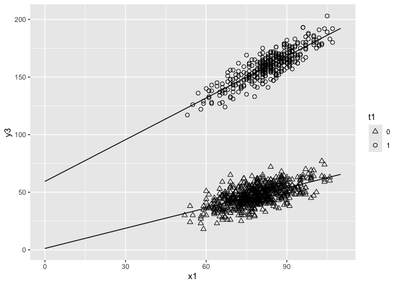

# chapter9_交互作用項のある共分散分析


## 前準備

``` r
library(tidyverse)
```

    ── Attaching core tidyverse packages ──────────────────────── tidyverse 2.0.0 ──
    ✔ dplyr     1.1.4     ✔ readr     2.1.5
    ✔ forcats   1.0.0     ✔ stringr   1.5.1
    ✔ ggplot2   3.5.1     ✔ tibble    3.2.1
    ✔ lubridate 1.9.3     ✔ tidyr     1.3.1
    ✔ purrr     1.0.2     
    ── Conflicts ────────────────────────────────────────── tidyverse_conflicts() ──
    ✖ dplyr::filter() masks stats::filter()
    ✖ dplyr::lag()    masks stats::lag()
    ℹ Use the conflicted package (<http://conflicted.r-lib.org/>) to force all conflicts to become errors

``` r
library(patchwork)

DATA09 <- "https://raw.githubusercontent.com/mtakahashi123/causality/main/data09.csv"
data09 <- read_csv(DATA09)
```

    Rows: 1000 Columns: 7
    ── Column specification ────────────────────────────────────────────────────────
    Delimiter: ","
    dbl (7): y0t, y1t, y0, y1, y3, x1, t1

    ℹ Use `spec()` to retrieve the full column specification for this data.
    ℹ Specify the column types or set `show_col_types = FALSE` to quiet this message.

## 共分散分析の仮定

共分散分析は重回帰モデルの一種のため、仮定１〜仮定６を満たす必要がある。さらに今日分散分析では、仮定７：回帰関数の平行性（homogeneity
of regression）を満たす必要がある。

7.  回帰の傾き $\beta_1$ が潜在的結果変数 $Y_i(0)$ と $Y_i(1)$
    の間で共通という仮定

仮定７が満たされていない時、交互作用項（interaction
term）のあるモデルを使う必要がある。

$$
Y_i = \beta_0 + \beta_1 X_i + \beta_2 T_i + \beta_3 X_i T_i + \varepsilon_i
$$

``` r
data09 |>
  mutate(
    t1 = factor(t1)
  ) |>
  ggplot(aes(x = x1, y = y3, shape = t1)) +
  geom_point(size = 2) +
  stat_smooth(method = "lm", se = FALSE, fullrange = TRUE, size = 0.5, color = "black") +
  scale_shape_manual(values = c(2, 1)) +
  scale_x_continuous(limits = c(0, 110)) +
  coord_cartesian(xlim = c(0, 110))
```

    Warning: Using `size` aesthetic for lines was deprecated in ggplot2 3.4.0.
    ℹ Please use `linewidth` instead.

    `geom_smooth()` using formula = 'y ~ x'

    Warning: Removed 1 row containing non-finite outside the scale range
    (`stat_smooth()`).

    Warning: Removed 1 row containing missing values or values outside the scale range
    (`geom_point()`).



$$
\tau_{ATE} = \mathbb{E}[Y_i (1)] - \mathbb{E}[Y_i(0)]
$$

``` r
print(mean(data09$y1t) - mean(data09$y0t))
```

    [1] 108.174

``` r
model1 <- lm(y3 ~ x1 + t1, data = data09)

# ATE = 108.174 < 108.872 <- 過大に推定されている
summary(model1)
```


    Call:
    lm(formula = y3 ~ x1 + t1, data = data09)

    Residuals:
         Min       1Q   Median       3Q      Max 
    -22.5455  -4.9870   0.1119   4.8973  25.7559 

    Coefficients:
                 Estimate Std. Error t value Pr(>|t|)    
    (Intercept) -17.71410    1.96401  -9.019   <2e-16 ***
    x1            0.82548    0.02475  33.355   <2e-16 ***
    t1          108.87202    0.51150 212.850   <2e-16 ***
    ---
    Signif. codes:  0 '***' 0.001 '**' 0.01 '*' 0.05 '.' 0.1 ' ' 1

    Residual standard error: 7.559 on 997 degrees of freedom
    Multiple R-squared:  0.9814,    Adjusted R-squared:  0.9813 
    F-statistic: 2.625e+04 on 2 and 997 DF,  p-value: < 2.2e-16

## 交互作用項のある共分散分析

$$
\begin{aligned}
Y_i &= \beta_0 + \beta_1 X_i + \beta_2 T_i + \beta_3 X T_i + \varepsilon_i \\
Y_i(T_i = 0) &= \beta_0 + \beta_1 X_i + \varepsilon_i \\
Y_i(T_i = 1) &= (\beta_0 + \beta_2) + (\beta_1 + \beta_3) X_i + \varepsilon_i
\end{aligned}
$$

``` r
# 交互作用項
x1t <- data09$x1 * data09$t1
model2 <- lm(y3 ~ x1 + t1 + x1t, data = data09)
summary(model2)
```


    Call:
    lm(formula = y3 ~ x1 + t1 + x1t, data = data09)

    Residuals:
        Min      1Q  Median      3Q     Max 
    -20.582  -4.498  -0.024   4.703  23.484 

    Coefficients:
                Estimate Std. Error t value Pr(>|t|)    
    (Intercept)  1.17837    2.31013    0.51     0.61    
    x1           0.58461    0.02924   19.99   <2e-16 ***
    t1          58.59279    3.83963   15.26   <2e-16 ***
    x1t          0.61809    0.04684   13.20   <2e-16 ***
    ---
    Signif. codes:  0 '***' 0.001 '**' 0.01 '*' 0.05 '.' 0.1 ' ' 1

    Residual standard error: 6.977 on 996 degrees of freedom
    Multiple R-squared:  0.9841,    Adjusted R-squared:  0.9841 
    F-statistic: 2.059e+04 on 3 and 996 DF,  p-value: < 2.2e-16

平均処置効果を推定できていないように見える。

### 平均処置効果

個体因果効果（ICE）

$$
\begin{aligned}
\tau_i &= Y_i(1) - Y_i(0) \\
\tau_i &= [ (\beta_0 + \beta_2) + (\beta_1 + \beta_3) X_i + \varepsilon_i] -[\beta_0 + \beta_1 X_i + \varepsilon_i] \\
\tau_i &= \beta_2 + \beta_3 X_i
\end{aligned}
$$

平均処置効果（ATE）

$$
\begin{aligned}
\tau_{ATE} &= \mathbb{E}[Y_i(1) - Y_i(0)] \\
\tau_{ATE} &= \mathbb{E}[\beta_2 + \beta_3 X_i] \\
\tau_{ATE} &= \mathbb{E}[\beta_2] + \mathbb{E}[{\beta_3 X_i}] \\
\tau_{ATE} &= \beta_2 + \beta_3 \mathbb{E}[X_i]
\end{aligned}
$$

``` r
library(broom)

b2 <- model2 |> broom::tidy() |> filter(term == "t1") |> pull(estimate)
b3 <- model2 |> broom::tidy() |> filter(term == "x1t") |> pull(estimate)

b2 + b3 * mean(data09$x1) # 真値 108 を正確に推定できている
```

    [1] 108.1368

### 標準誤差

$\tau_{ATE}$ の標準誤差は、
$\tau_{ATE} = \beta_2 + \beta_3 \mathbb{E}[X_i]$ より以下のようになる。

$$
\begin{aligned}
\mathrm{var}[\tau_{ATE}] &= \mathrm{var}[\beta_2 + \beta_3 \mathbb{E}[X_i]] \\
&= var[\beta_2] + \left( \mathbb{E}[X_i] \right)^2 \mathrm{var}[\beta_3] + \mathrm{E}[X_i] 2 \mathrm{cov}[\beta_2, \beta_3] \\
s.e.(\tau_{ATE}) &= \sqrt{var[\beta_2] + \left( \mathbb{E}[X_i] \right)^2 \mathrm{var}[\beta_3] + \mathrm{E}[X_i] 2 \mathrm{cov}[\beta_2, \beta_3]}
\end{aligned}
$$

``` r
print(vcov(model2))
```

                (Intercept)            x1          t1           x1t
    (Intercept)  5.33671845 -0.0670699808 -5.33671845  0.0670699808
    x1          -0.06706998  0.0008551192  0.06706998 -0.0008551192
    t1          -5.33671845  0.0670699808 14.74276058 -0.1784958383
    x1t          0.06706998 -0.0008551192 -0.17849584  0.0021942920

``` r
v2 <- diag(vcov(model2))[3]
v3 <- diag(vcov(model2))[4]
print(v2)
```

          t1 
    14.74276 

``` r
print(v3)
```

            x1t 
    0.002194292 

``` r
x1bar <- mean(data09$x1)
cov23 <- vcov(model2)[3, 4]
vartau <- v2 + x1bar^2 * v3 + x1bar * 2 * cov23
setau <- sqrt(vartau)
setau
```

           t1 
    0.4754235 

### 簡便な方法

``` r
x1t2 <- (data09$x1 - mean(data09$x1)) * (data09$t1 - mean(data09$t1))
model3 <- lm(y3 ~ x1 + t1 + x1t2, data = data09)
summary(model3)
```


    Call:
    lm(formula = y3 ~ x1 + t1 + x1t2, data = data09)

    Residuals:
        Min      1Q  Median      3Q     Max 
    -20.582  -4.498  -0.024   4.703  23.484 

    Coefficients:
                 Estimate Std. Error t value Pr(>|t|)    
    (Intercept) -16.70701    1.81453  -9.207   <2e-16 ***
    x1            0.80774    0.02288  35.297   <2e-16 ***
    t1          108.13678    0.47542 227.454   <2e-16 ***
    x1t2          0.61809    0.04684  13.195   <2e-16 ***
    ---
    Signif. codes:  0 '***' 0.001 '**' 0.01 '*' 0.05 '.' 0.1 ' ' 1

    Residual standard error: 6.977 on 996 degrees of freedom
    Multiple R-squared:  0.9841,    Adjusted R-squared:  0.9841 
    F-statistic: 2.059e+04 on 3 and 996 DF,  p-value: < 2.2e-16
